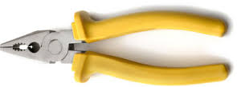

```{r setup, include=FALSE}
knitr::opts_chunk$set(echo = TRUE, warning=FALSE, comment="OUTPUT> ", background='yellow' )
options("width"=512)


```
```{r packages}
#install.packages("Lahman")
#library(Lahman)

```

## plyr and dplyr basics
This is a very quick introduction to plyr. For more details see Hadley Wickham's introductory guide The [split-apply-combine strategy for data analysis](http://www.jstatsoft.org/v40/i01)

### The PLYR package

is a set of tools that makes it simple to split data apart, do stuff to it, and mash it back together.  Commonly referred to as: *split-apply-combine (SAC) procedures*. 

This is a common data-manipulation step. 

To demonstrate the use of the plyr tools we tke a look at the [Gapminder dataset](https://www.stat.ubc.ca/~jenny/notOcto/STAT545A/examples/gapminder/data/gapminderDataFiveYear.txt)


### The DPLYR package
dplyr is a new package which provides a set of tools for efficiently manipulating datasets in R.

dplyr is the next iteration of plyr, focussing on only data frames. 

dplyr is faster and easier to use. 

###  Why use dplyr instead of plyr tools

In plyr, we might write code like this:

```{r mplyr}

library(plyr)

games <- ddply(Batting, "playerID", summarise, total = sum(G))
head(arrange(games, desc(total)), 5)

```

We use ddply() to break up the Batting dataframe into pieces according to the playerID variable, then apply summarise() to reduce the player data to a single row. 

Each row in Batting represents one year of data for one player, so we figure out the total number of games with sum(G) and save it in a new variable called total. 

We sort the result so the most games come at the top and then use head() to pull off the first five.

In dplyr, the code is similar:

```{r dplyr}

library(dplyr)

players <- group_by(Batting, playerID)
games <- summarise(players, total = sum(G))
head(arrange(games, desc(total)), 5)
```


### Chaining in dplyr
dplyr provides another innovation over plyr: 
the ability to chain operations together from left to right with the %.% operator. 

This makes dplyr behave a little like a grammar of data manipulation:

```{r chain}

Batting %.%
  group_by(playerID) %.%
  summarise(total = sum(G)) %.%
  arrange(desc(total)) %.%
  head(5)

```
  
  

```{r import_data}
# read from internet 
#filename <- 'http://www.stat.ubc.ca/~jenny/notOcto/STAT545A/examples/gapminder/data/gapminderDataFiveYear.txt'


# read locally
filename <- "data/gapminderDataFiveYear.txt"

gData <- read.delim(filename)

```

### Descriptive statistics

Basic sanity check that the import has gone well.

The dataset has: 1704 subjects and 6 variables.

```{r describe}
dim(gData)
head(gData, n =3)
str(gData)
summary(gData)

#-- box plot of "pop", "lifeExp" and "gadpPrcap":
plot(gData$continent, gData$lifeExp, col = c("red","green","palevioletred1","royalblue2", "yellow"),las = 2)
grid()

```


### Heart of plyr
The heart of plyr is a set a functions with names like this: XYply where X specifies what sort of input you're giving and Y specifies the sort of output you want.

    * a = array, where matrices and vectors are important special cases
    * d = data.frame
    * l = list
    * _ = no output; only valid for Y, obviously; useful when you're operating on a list purely for the side effects, e.g., making a plot or sending output to screen/file


### Data aggregation
Suppose we decide to store a subset (little snippet) of the dataset

```{r snippet}
(snippet <- subset(gData, country == "Canada"))
```


### dplyr

### The Five verbs in dplyr

dplyr is built around 5 verbs. These verbs make up the majority of the data manipulation you tend to do. You might need to:

*Select* certain columns of data.

*Filter* your data to select specific rows.

*Arrange* the rows of your data into an order.

*Mutate* your data frame to contain new columns.

*Summarise* chunks of you data in some way.


###
dplyr also provides a function glimpse() that makes it easy to look at our data in a transposed view. It's similar to the str() (structure) function, but has a few advantages (see ?glimpse).

### Looking at the data using dplr
```{r datalook}
library(dplyr)
glimpse(gData)

```


### Data aggregation
Suppose we decide to store a subset (little snippet) of the dataset

```{r snippet11 }
(snippet <- subset(gData, country == "Canada"))

# dplyr

```

###The dplyr R package is awesome. Pipes from the magrittr R package are awesome. Put the two together and you have one of the most exciting things to happen to R in a long time.

dplyr is Hadley Wickham's re-imagined plyr package (with underlying C++ secret sauce co-written by Romain Francois). plyr 2.0 if you will. It does less than dplyr, but what it does it does more elegantly and much more quickly.

dplyr is built around 5 verbs. These verbs make up the majority of the data manipulation you tend to do. You might need to:

Select certain columns of data.

Filter your data to select specific rows.

Arrange the rows of your data into an order.

Mutate your data frame to contain new columns.

Summarise chunks of you data in some way.

Let's look at how those work.
