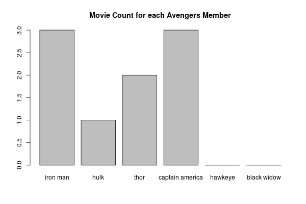
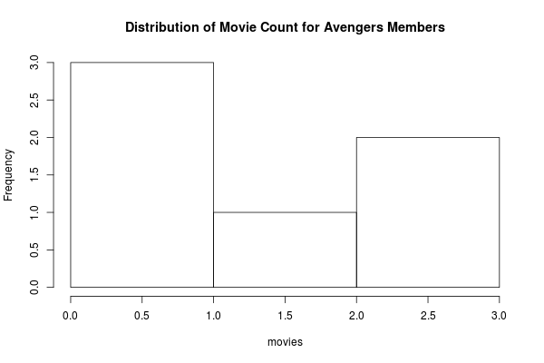
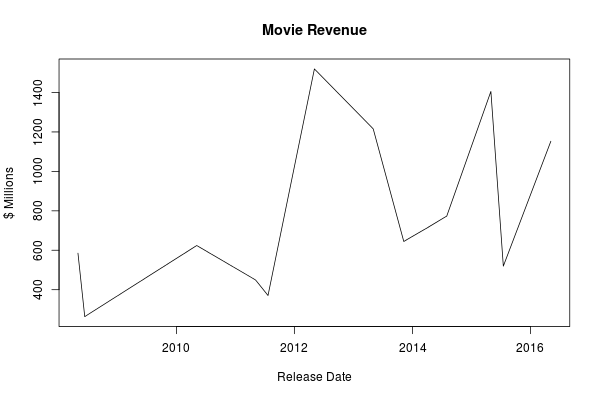
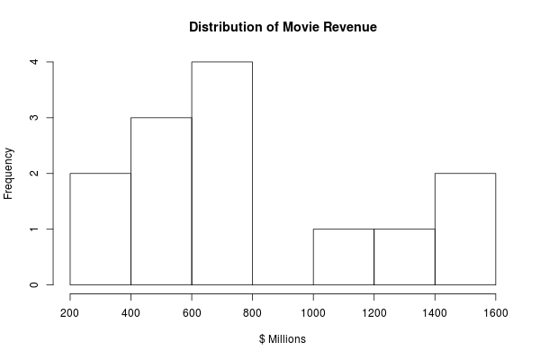
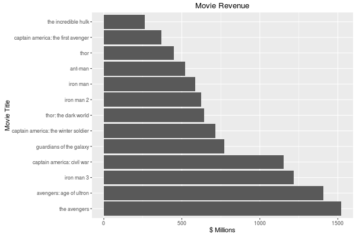
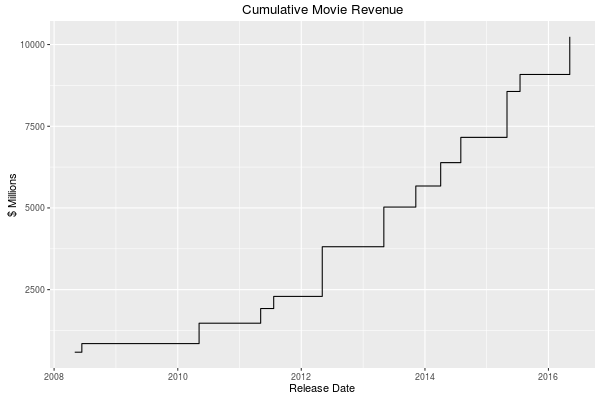
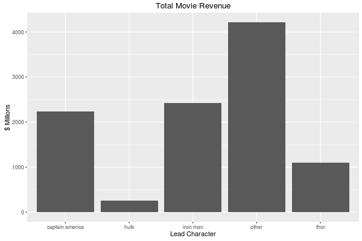
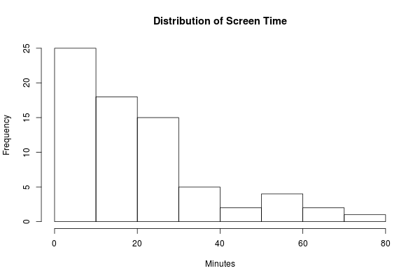
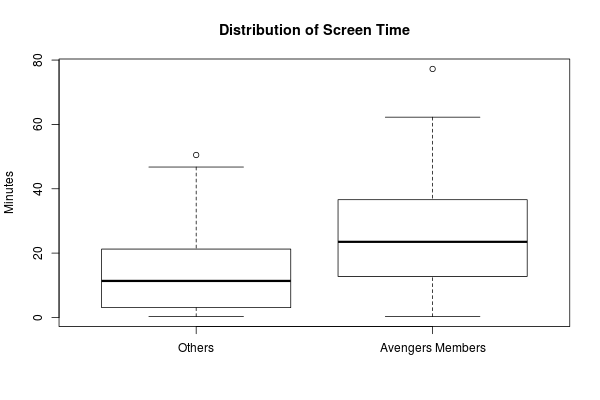
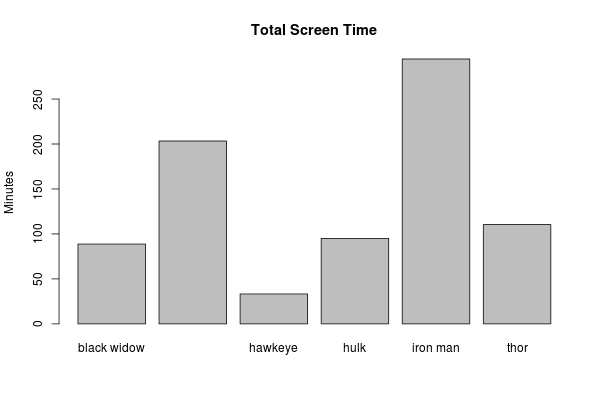

Exploring Data, Continued
================
Damian Thomas
2016-09-23

Welcome & Setup
---------------

1.  Log in to network
2.  Update course materials from github
    -   <https://github.com/wampeh1/ECOG_314>

3.  Open lecture file in RStudio
    -   Lecture4.Rmd

------------------------------------------------------------------------

Homework
--------

-   Feedback

------------------------------------------------------------------------

Recap Lecture 3
---------------

### Rstudio Interface

Four panels and a menu

-   Inputs
-   Outputs
-   Options

### Managing Your Rstudio Session

-   Workspace (R environment): Save, Clear, and re-load
-   R Session: restart, set working directory
-   Customize appearance and behavior

*In Class Exercise: Practice managing Rstudio session*

### R Object types

-   Vectors: one dimension, one type
-   Lists: one dimension, many types
-   Matrices: two dimensions, one type
-   Data Frames: two dimensions, many types

### R syntax

-   Object
-   Function
-   Subsetting

### R Syntax Examples - Object creation

-   Vectors as column variables
-   Data frames as collections of variables
-   Lists as single observations
-   Data frames as stacks of observations

### R Syntax Examples - Object subsetting

-   The Bracket "\[" - subset vectors and data frames by index or element name
-   The Double Bracket "\[\[" - subset list by index or element name
-   The Dollar "$" - subset data frame by variable name, list by element name

### R Syntax Examples - Expressions and Functions

-   The Paren "(" - group expressions and evaluate
-   The Brace "{" - encapsulate one or more expressions into a separate block of code

#### The Function

-   Do things with objects using functions
-   Hoe to define a new function
-   \*Everything\* is function or an object

### Reading Data

-   Various formats

### Viewing Data

-   RStudio windows: environment, etc.
-   Console: print(), str(), etc.

### Getting help

-   Cookbook R: <http://www.cookbook-r.com/Data_input_and_output/Loading_data_from_a_file/> - recipes for common tasks
-   Datacamp Tutorials: <https://www.datacamp.com/community/tutorials/importing-data-r-part-two>
-   Stack Overflow: <http://stackoverflow.com/questions/tagged/r> - searchable Q&A
-   R Bloggers: <https://www.r-bloggers.com/read-excel-files-from-r/> - brief posts with examples, links to other sites
-   [google](http://www.google.com) - is your friend

### Running Code

1.  One line of code
2.  Multiple lines of code
3.  Entire program
4.  Markdown documents

Practice Running Code
---------------------

*In Class Exercises: Practice Running Code*

-   hello.R

-   hello.Rmd

------------------------------------------------------------------------

Lecture 4: Exploring Data
=========================

Data Set Categories
-------------------

Data sets fall into 3 major categories:

-   *cross sectional*
-   *time series*
-   *panel or longitudinal*

#### Cross Sectional Data

A single measure (or set of measures) observed from multiple entities at the same point in time.

> "Cross-sectional data, or a cross section of a study population, in statistics and econometrics is a type of data collected by observing many subjects (such as individuals, firms, countries, or regions) at the same point of time, or without regard to differences in time. Analysis of cross-sectional data usually consists of comparing the differences among the subjects."

*- [Wikipedia, 2016-09-15](https://en.wikipedia.org/wiki/Cross-sectional_data)*

#### Time series Data

A single measure, or set of measures, observed at different points in time.

> "Most commonly, a ***time series*** is a sequence taken at successive equally spaced points in time. Thus it is a sequence of discrete-time data. Examples of time series are heights of ocean tides, counts of sunspots, and the daily closing value of the Dow Jones Industrial Average"

*- Source [Wikipedia, 2016-09-15](https://en.wikipedia.org/wiki/Time_series)*

#### Panel Data

Cross sectional data from multiple points in time

> "In statistics and econometrics, the term panel data refers to multi-dimensional data frequently involving measurements over time. Panel data contain observations of multiple phenomena obtained over multiple time periods for the same firms or individuals. In biostatistics, the term longitudinal data is often used instead, wherein a subject or cluster constitutes a panel member or individual in a longitudinal study. Time series and cross-sectional data can be thought of as special cases of panel data that are in one dimension only (one panel member or individual for the former, one time point for the latter)."

-   -   Source: [Wikipedia, 2016-03-30](https://en.wikipedia.org/wiki/Panel_data)\*

Analysis Workflow
-----------------


(Image source: [R for Data Science](http://r4ds.had.co.nz/))

This framework is useful for organizing our efforts. In this session we will practice importing data, cleaning data, and transforming it to help us answer (and generate) questions with plots.

We will carry out the following tasks

-   Import data
-   Compute summary statistics
-   Transform and create new variables
-   Subset observations conditionally
-   Compute aggregates
-   Compute aggregates for subsets of observations
-   Visualize data
    -   bar graph
    -   line graph:
    -   scatterplot
    -   boxplot
-   Merge data sets

Tools
-----

We will use these functions and packages

#### Base R

-   Import:
    -   read.table(), and related functions
-   Aggregations:
    -   summary()
    -   mean()
    -   median()
    -   sd() & var()
    -   min() & max
    -   sum()
    -   length()
-   Transformations
    -   ifelse()
    -   sub() & gsub()
    -   merge()
    -   subset()
-   Visualization
    -   plot()
    -   hist()
    -   etc.

#### Tidyverse alternatives

-   dplyr
-   reshape2
-   ggplot2

Central Question
----------------

Which marvel characters generate the most movie revenue?

The plan is to combine data from several sources and compare the characters based on a series of revenue generation measures.

Import Data Sets
----------------

1.  an avengers team roster
2.  revenue for each marvel movie
3.  time on screen

### Avengers team roster

``` r
avengers <- read.csv("data/raw/avengers.csv", stringsAsFactors = FALSE)
avengers
```

    ##          codename movies
    ## 1        Iron Man      3
    ## 2            Hulk      1
    ## 3            Thor      2
    ## 4 Captain America      3
    ## 5         Hawkeye      0
    ## 6     Black Widow      0

``` r
str(avengers)
```

    ## 'data.frame':    6 obs. of  2 variables:
    ##  $ codename: chr  "Iron Man" "Hulk" "Thor" "Captain America" ...
    ##  $ movies  : int  3 1 2 3 0 0

Source: Wikipedia ()

-   Each observation represents a single member of the team
-   Variables (2): team member codename, and the total number of movies in the current

### Movie Revenue

``` r
movies <- read.delim("data/raw/movies.txt", sep = "|", stringsAsFactors = FALSE)
movies
```

    ##                                  title        revenue         released
    ## 1                             Iron Man   $585,174,222      May 2, 2008
    ## 2                  The Incredible Hulk   $263,427,551    June 13, 2008
    ## 3                           Iron Man 2   $623,933,331      May 7, 2010
    ## 4                                 Thor   $449,326,618      May 6, 2011
    ## 5   Captain America: The First Avenger   $370,569,774    July 22, 2011
    ## 6                Marvel's The Avengers $1,519,557,910      May 4, 2012
    ## 7                           Iron Man 3 $1,215,439,994      May 3, 2013
    ## 8                 Thor: The Dark World   $644,602,516 November 8, 2013
    ## 9  Captain America: The Winter Soldier   $714,421,503    April 4, 2014
    ## 10             Guardians of the Galaxy   $773,312,399   August 1, 2014
    ## 11             Avengers: Age of Ultron $1,405,413,868      May 1, 2015
    ## 12                             Ant-Man   $519,445,163    July 17, 2015
    ## 13          Captain America: Civil War $1,152,745,930      May 6, 2016

``` r
str(movies)
```

    ## 'data.frame':    13 obs. of  3 variables:
    ##  $ title   : chr  "Iron Man" "The Incredible Hulk" "Iron Man 2" "Thor" ...
    ##  $ revenue : chr  "$585,174,222" "$263,427,551" "$623,933,331" "$449,326,618" ...
    ##  $ released: chr  "May 2, 2008" "June 13, 2008" "May 7, 2010" "May 6, 2011" ...

Source: Wikipedia (<https://en.wikipedia.org/wiki/List_of_Marvel_Cinematic_Universe_films#Box_office_performance>)

-   Each observation represents a single movie
-   Variables (3): the name of the movie, the total revenue, and the release date

### Screen time

``` r
screen_time <- read.delim("data/raw/screen_time.txt", sep = "\t", header = FALSE, stringsAsFactors = FALSE)
head(screen_time, 25)
```

    ##                  V1                                            V2
    ## 1        Tony Stark                            * IRON MAN <77:15>
    ## 2        Tony Stark                   * THE INCREDIBLE HULK <:30>
    ## 3        Tony Stark                          * IRON MAN 2 <61:15>
    ## 4        Tony Stark                        * THE AVENGERS <32:15>
    ## 5        Tony Stark                          * IRON MAN 3 <62:15>
    ## 6        Tony Stark             * AVENGERS: AGE OF ULTRON <27:15>
    ## 7        Tony Stark          * CAPTAIN AMERICA: CIVIL WAR <33:45>
    ## 8   Captain America  * CAPTAIN AMERICA: THE FIRST AVENGER <56:30>
    ## 9   Captain America                        * THE AVENGERS <28:15>
    ## 10  Captain America    * CAPTAIN AMERICA: THE WINTER SOLDIER <59>
    ## 11  Captain America             * AVENGERS: AGE OF ULTRON <21:45>
    ## 12  Captain America                       * ANT-MAN (cameo) <:15>
    ## 13  Captain America             * CAPTAIN AMERICA: CIVIL WAR <36>
    ## 14             Thor                                * THOR <43:15>
    ## 15             Thor                           * THE AVENGERS <18>
    ## 16             Thor                   * THOR: THE DARK WORLD <35>
    ## 17             Thor             * AVENGERS: AGE OF ULTRON <13:15>
    ## 18     Bruce Banner                 * THE INCREDIBLE HULK <51:45>
    ## 19     Bruce Banner                        * THE AVENGERS <22:15>
    ## 20     Bruce Banner                    * IRON MAN 3 (cameo) <:45>
    ## 21     Bruce Banner                * AVENGERS: AGE OF ULTRON <20>
    ## 22 Natasha Romanoff                           * IRON MAN 2 <9:15>
    ## 23 Natasha Romanoff                        * THE AVENGERS <24:45>
    ## 24 Natasha Romanoff * CAPTAIN AMERICA: THE WINTER SOLDIER <24:45>
    ## 25 Natasha Romanoff                * AVENGERS: AGE OF ULTRON <18>

``` r
str(screen_time)
```

    ## 'data.frame':    72 obs. of  2 variables:
    ##  $ V1: chr  "Tony Stark" "Tony Stark" "Tony Stark" "Tony Stark" ...
    ##  $ V2: chr  "* IRON MAN <77:15>" "* THE INCREDIBLE HULK <:30>" "* IRON MAN 2 <61:15>" "* THE AVENGERS <32:15>" ...

Source: IMDb (<http://www.imdb.com/list/ls036115103/>)

-   Each observation represents a movie appearance for a given character
-   Variables (2): character name/codename, and text with the movie title and total screen time combined

------------------------------------------------------------------------

### Tidy and Transform

What is the state of the data? Tidy? Ready for plotting and analysis?

Not quite.

-   avengers data frame: tidy, needs minor adjustments
    -   Has a shared identifier: hero codename
    -   Need to reformat codename for merging
-   movies data frame: tidy, but needs some transformations to be useful
    -   The revenue and date variables are text
        -   can't compute averages, etc.
        -   can't sort in meaningful order
    -   Need to add a shared identifier for merging
-   screen\_time data frame: Not tidy, needs a lot of work
    -   No variable names in raw data
    -   Multiple types of information contained in the second variable
    -   No shared identifier for merging

#### Tidy and Transform: Avengers Roster

-   Standardize codenames

``` r
source("clean_avengers_data.R", echo = FALSE)
```

#### Tidy and Transform: Movie Revenue

-   Convert revenues to numeric values and change unit of measure from $1 to $1 Million
-   Capture the dates
-   Simplify titles (lowercase)

``` r
source("clean_movies_data.R", echo = FALSE)
```

#### Tidy and Transform: Screen time

``` r
source("clean_screen_time_data.R", echo = FALSE)
```

### Take a look at the data

Before plotting or summarizing the data, make sure you know what the data look like.

\*\*\* In Class Exercise \*\*\*

1.  Open one of the scripts in RStudio.
2.  Run it.
3.  Inspect the results
    -   objects created in the global environment
    -   csv files created in the local ./data directory

### Visualize

#### Visualize - Avengers roster

``` r
source("plot_avengers_data.R", echo = FALSE)
```





### Questions

-   How many movies have been made?
-   Average number of movies?
-   Who has the most movies?

``` r
sum(avengers$movies)
```

    ## [1] 9

``` r
mean(avengers$movies)
```

    ## [1] 1.5

``` r
avengers[ avengers$movies == max(avengers$movies), ]
```

    ##          codename movies
    ## 1        iron man      3
    ## 4 captain america      3

As usual, there is more than one way to get an answer. We could use the subset function instead of the single bracket

``` r
subset(avengers, avengers$movies == max(avengers$movies)) # subset with function
```

    ##          codename movies
    ## 1        iron man      3
    ## 4 captain america      3

Or, we could sort the data frame in ascending order by the number of movies, then show the last 3 entries

``` r
tail( avengers[ order(avengers$movies),], 3)
```

    ##          codename movies
    ## 3            thor      2
    ## 1        iron man      3
    ## 4 captain america      3

#### Answers

-   *How many movies have been made with the 6 primary avengers?* 9
-   *Average number of movies per member?* 1.5
-   *Who has the most movies?* It's a tie: iron man, captain america
-   *Which character is most successful?* Hard to tell without more data.

#### Visualize - Movie Revenue

``` r
source("plot_movies_data.R", echo = FALSE)
```











#### Questions (movie revenues)

-   How many movies have been made?

-   Average revenue?

-   Which movie made the least?

-   Which avenger made the most money?

``` r
df <- movies
df[is.na(movies$codename), "codename"] <- "other"
df <- with(df,
     
     aggregate(revenue, by = list(codename), FUN = "sum")
)
names(df) <- c("codename", "total_revenue")
df
```

    ##          codename total_revenue
    ## 1 captain america     2237.7372
    ## 2            hulk      263.4276
    ## 3        iron man     2424.5475
    ## 4           other     4217.7293
    ## 5            thor     1093.9291

Calculate with dplyr (alternative)

``` r
movies %>% 
    mutate(codename = ifelse(is.na(codename), "other", codename)) %>%
    group_by(codename) %>%
    summarise(total_revenue = sum(revenue),
              total_appearances = n()) %>%
    data.frame()
```

    ##          codename total_revenue total_appearances
    ## 1 captain america     2237.7372                 3
    ## 2            hulk      263.4276                 1
    ## 3        iron man     2424.5475                 3
    ## 4           other     4217.7293                 4
    ## 5            thor     1093.9291                 2

#### Answers (movies)

-   *How many movies have been made?13*
-   *Total revenue? : 10.2 billion*
-   *Average revenue? 787 million*
-   *Which movie made the least? the incredible hulk*

#### Visualize - Screen Time

``` r
source("plot_screen_time_data.R", echo = FALSE)
```







------------------------------------------------------------------------

#### Summary Stats - screen time

``` r
summary(screen_time)
```

    ##      name              title              minutes           cameo        
    ##  Length:72          Length:72          Min.   : 0.250   Min.   :0.00000  
    ##  Class :character   Class :character   1st Qu.: 5.312   1st Qu.:0.00000  
    ##  Mode  :character   Mode  :character   Median :16.500   Median :0.00000  
    ##                                        Mean   :19.270   Mean   :0.09722  
    ##                                        3rd Qu.:24.917   3rd Qu.:0.00000  
    ##                                        Max.   :77.250   Max.   :1.00000  
    ##    codename           is_avenger    
    ##  Length:72          Min.   :0.0000  
    ##  Class :character   1st Qu.:0.0000  
    ##  Mode  :character   Median :0.0000  
    ##                     Mean   :0.4167  
    ##                     3rd Qu.:1.0000  
    ##                     Max.   :1.0000

``` r
sd(screen_time$minutes)
```

    ## [1] 17.5684

``` r
# Standard deviation for avengers
with( subset(screen_time, screen_time$is_avenger == 1),
      sd(minutes)
)
```

    ## [1] 20.88248

``` r
# average screen time for each avenger
df <- with( subset(screen_time, screen_time$is_avenger == 1),
      aggregate(minutes, by = list(codename), FUN = "mean")
)
names(df) <- c("codename", "average_minutes")
df
```

    ##          codename average_minutes
    ## 1     black widow        17.76000
    ## 2 captain america        33.88889
    ## 3         hawkeye         8.31250
    ## 4            hulk        23.77083
    ## 5        iron man        42.07143
    ## 6            thor        27.59583

``` r
#  total appearances for each avenger
df <- with( subset(screen_time, screen_time$is_avenger == 1),
      aggregate(codename, by = list(codename), FUN = "length")
)
names(df) <- c("codename", "total_appearances")
df
```

    ##          codename total_appearances
    ## 1     black widow                 5
    ## 2 captain america                 6
    ## 3         hawkeye                 4
    ## 4            hulk                 4
    ## 5        iron man                 7
    ## 6            thor                 4

Calculate with dplyr (alternative)

``` r
screen_time %>% 
    
    mutate(codename = ifelse(is.na(codename), "other", codename)) %>%
    
    group_by(codename) %>%
    
    summarise(total_minutes = sum(minutes),
              total_appearances = n(),
              avgerage_minutes = mean(minutes),
              sd_minutes = sd(minutes)) %>%
    
    arrange(desc(total_minutes)) %>%
    
    data.frame()
```

    ##           codename total_minutes total_appearances avgerage_minutes
    ## 1         iron man     294.50000                 7        42.071429
    ## 2  captain america     203.33333                 6        33.888889
    ## 3             thor     110.38333                 4        27.595833
    ## 4             hulk      95.08333                 4        23.770833
    ## 5      black widow      88.80000                 5        17.760000
    ## 6     pepper potts      63.55000                 4        15.887500
    ## 7             loki      60.25000                 3        20.083333
    ## 8       scott lang      55.25000                 2        27.625000
    ## 9      jane foster      46.76667                 2        23.383333
    ## 10       star-lord      46.75000                 1        46.750000
    ## 11    james rhodes      45.35000                 5         9.070000
    ## 12       nick fury      43.80000                 7         6.257143
    ## 13  winter soldier      42.98333                 4        10.745833
    ## 14         hawkeye      33.25000                 4         8.312500
    ## 15          gamora      31.51667                 1        31.516667
    ## 16      sam wilson      27.53333                 4         6.883333
    ## 17      betty ross      27.45000                 1        27.450000
    ## 18        hank pym      24.25000                 1        24.250000
    ## 19     erik selvig      24.05000                 4         6.012500
    ## 20  wanda maximoff      22.61667                 3         7.538889
    ##    sd_minutes
    ## 1   26.223683
    ## 2   22.406504
    ## 3   14.154723
    ## 4   21.031103
    ## 5    7.185959
    ## 6    8.006287
    ## 7    2.240722
    ## 8   32.350135
    ## 9    2.875568
    ## 10         NA
    ## 11   6.058527
    ## 12   7.524152
    ## 13   8.863913
    ## 14   6.868937
    ## 15         NA
    ## 16   6.544421
    ## 17         NA
    ## 18         NA
    ## 19   5.673825
    ## 20   6.393711

Merging
-------

merge() function

Combine the movie revenue data with the screen time data. Explore how variation in revenue might be related to character screen time.

Homework Exercises (continued from week 3)
------------------------------------------

Explore a data set

1.  Choose a raw data set, and download it.
    -   Advanced option: use R to download the file (not required)

2.  Import the data into R
3.  Do at least 3 data transformations, Explain your reasoning. For example:
    -   change the units
    -   rename variables
    -   merge in additional variables
    -   compute a new variable ( categorical label, etc.)
    -   aggregate
    -   subset or sample

4.  Do at least one plot
5.  Compute summary statistics
6.  Address the following questions
    -   Categorize the data set (e.g., panel data), describe it
    -   Provide link to the source
    -   Describe most interesting patterns (or lack thereof). E.g.: shape of distribution, time trend, seasonality, changes in volatility, extreme values, etc.
    -   Offer a future question to investigate or a next step to take

7.  Turn in your results as either
    -   an r script (.R or .r file, with text answers as code comments )
    -   an r markdown document (.Rmd or .rmd file)

8.  Bonus: include links to websites or documentation used to figure things out. Indicate what you used each for as briefly as possible. \*\*\*

Resources
---------

<http://tryr.codeschool.com/>

<https://www.rstudio.com/online-learning/#R>

<http://adv-r.had.co.nz/>

<https://github.com/hadley/r4ds>
