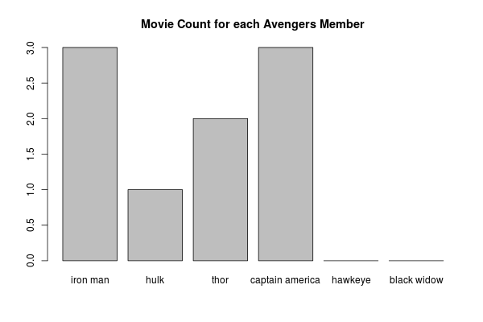
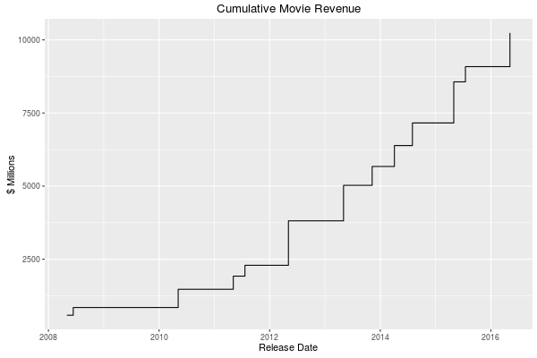
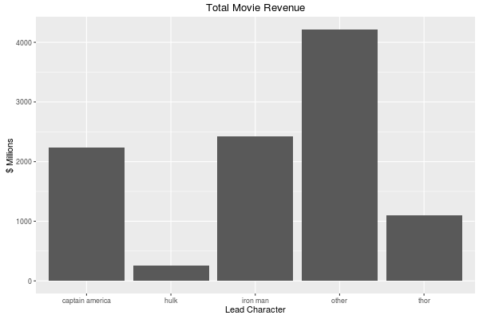
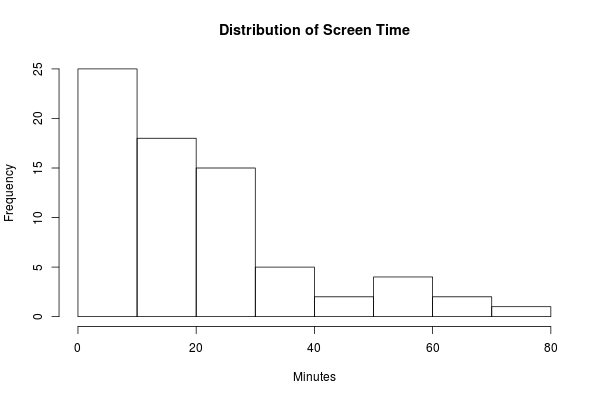
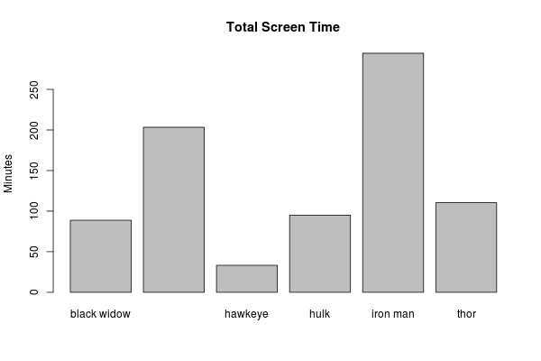

```{r setup, include=FALSE}
#github_document
knitr::opts_chunk$set(echo = TRUE)
```

## Welcome & Setup

1. Log in to network 
2. Update course materials from github
    * https://github.com/wampeh1/ECOG_314
3. Open lecture file in RStudio
    * Lecture5.Rmd

***
## Midterm

* Schedule

## Homework 

* Feedback

## Getting help online

* Cookbook R: [http://www.cookbook-r.com/Data_input_and_output/Loading_data_from_a_file/](http://www.cookbook-r.com/Data_input_and_output/Loading_data_from_a_file/) - recipes for common tasks
* Datacamp Tutorials: [https://www.datacamp.com/community/tutorials/importing-data-r-part-two](https://www.datacamp.com/community/tutorials/importing-data-r-part-two) 
* Stack Overflow: [http://stackoverflow.com/questions/tagged/r](http://stackoverflow.com/questions/tagged/r) - searchable Q&A 
* R Bloggers: [https://www.r-bloggers.com/read-excel-files-from-r/](https://www.r-bloggers.com/read-excel-files-from-r/) - brief posts with examples, links to other sites
* [google](http://www.google.com) - is your friend

Free online books

* Advanced R (http://adv-r.had.co.nz/)
* R for Data Science (http://r4ds.had.co.nz/)


## Resources

[http://tryr.codeschool.com/](http://tryr.codeschool.com/)

[https://www.rstudio.com/online-learning/#R](https://www.rstudio.com/online-learning/#R)

[http://adv-r.had.co.nz/](http://adv-r.had.co.nz/)

[https://github.com/hadley/r4ds](https://github.com/hadley/r4ds)

***

## Recap Lecture 3

* Rstudio Interface 
* Managing Your Rstudio Session 
* R Object types
* R syntax
    * Object creation
    * Object subsetting
    * Expressions
    * Functions
* Reading Data
* Viewing Data
* Running Code - hello.R

***
## Recap Lecture 4

### Data Set Categories

Data sets fall into 3 major categories:  

* *cross sectional*
* *time series*
* *panel or longitudinal*

### Analysis Workflow 

```{r get_image, echo=FALSE}
dir.create("images", showWarnings = FALSE)
if ( !file.exists("images/data-science.png") ) download.file("http://r4ds.had.co.nz/diagrams/data-science.png", "images/data-science.png", mode = "wb", method = "wget")
```

 

(Image source: [R for Data Science](http://r4ds.had.co.nz/))

This framework is useful for organizing our efforts. In this session we will practice importing data, cleaning data, and transforming it to help us answer (and generate) questions with plots.


### Tasks 

* Import data
* Create and alter variables
* Compute summary statistics 
* Subset observations 
    * and compute aggregates for subsets
* Visualize data
* Merge data sets
* Transform data (restucture)


### Tools 

#### Base R

* Import: 
    * read.table(), and related functions
* Aggregations: 
    * summary()
    * mean()
    * median()
    * sd() & var()
    * min() & max
    * sum()
    * length()
* Transformations
    * ifelse()
    * sub() & gsub()
    * lag()
    * merge()
    * subset()
* Visualization
    * plot()
    * hist()
    * etc.

#### Tidyverse alternatives

* dplyr
* reshape2
* ggplot2


***

# Lecture 5: Exploring Data, Part 3


## Central Question

Which marvel characters generate the most movie revenue? 

The plan is to combine data from several sources and compare the characters based on a series of revenue generation measures.


## Source Data 

From Wikipedia (https://en.wikipedia.org/wiki/List_of_Marvel_Cinematic_Universe_films) and IMDb (http://www.imdb.com/list/ls036115103/)


1. an avengers team roster
    * Each observation represents a single member of the team
    * Variables (2): team member codename, and the total number of movies in the current 

2. revenue for each marvel movie
    * Each observation represents a single movie
    * Variables (3): the name of the movie, the total revenue, and the release date

3. time on screen
    * Each observation represents a movie appearance for a given character
    * Variables (2): character name/codename, and text with the movie title and total screen time combined


### Avengers team roster

```{r recreate_avengers_df, echo = TRUE}
avengers <- read.csv("data/raw/avengers.csv", stringsAsFactors = FALSE)
avengers
str(avengers)
```


### Movie Revenue

```{r avenger_movie_info, echo = TRUE}
movies <- read.delim("data/raw/movies.txt", sep = "|", stringsAsFactors = FALSE)
movies
str(movies)
```


### Screen time

```{r screen_time_data}
screen_time <- read.delim("data/raw/screen_time.txt", sep = "\t", header = FALSE, stringsAsFactors = FALSE)
head(screen_time, 25)
str(screen_time)
```


***

### Tidy and Transform

What is the state of the data? Tidy? Ready for plotting and analysis? Not quite.

* avengers data frame
    * Need to reformat codename for merging
* movies data frame
    * The revenue and date variables are text (can't do math or sort in a meaningful order)
    * No shared identifier for merging 
* screen_time data frame
    * No variable names 
    * Multiple bits information in single text variable
    * No shared identifier for merging

Code to accomplish these tasks is included in the course repository. We will examine the programs separately

```{r transform_avengers_df, include = TRUE, results = 'hide'}
source("clean_avengers_data.R", echo = FALSE)
```

```{r transform_movies, include = TRUE, results = 'hide'}
source("clean_movies_data.R", echo = FALSE)
```

```{r tidy_transform_scree_time, include = TRUE, results = 'hide'}
source("clean_screen_time_data.R", echo = FALSE)
```


### Visualize

Once we have clean data sets, we can explore with plots and summaries

#### Visualize - Avengers roster

```{r plot_avengers_df, include = TRUE, results = 'hide'}
source("plot_avengers_data.R", echo = FALSE)
```




### Questions

* How many movies have been made?  
* Average number of movies?
* Who has the most movies?

```{r movie_questions, include = TRUE, results = 'hide'}
# Movies made
sum(avengers$movies)

# Average
mean(avengers$movies)

# Most movies, multiple methods
avengers[ avengers$movies == max(avengers$movies), ]      # conditional subset with "["

subset(avengers, avengers$movies == max(avengers$movies)) # conditional subset with function

tail( avengers[ order(avengers$movies),], 3)              # ordered subset or observations
```

#### Answers

* How many movies have been made with the 6 primary avengers? `r sum(avengers$movies)`
* Average number of movies per member? `r mean(avengers$movies)`
* Who has the most movies?* It's a tie: `r avengers[ avengers$movies == max(avengers$movies), "codename"]`
* Which character is most successful? Hard to tell without more data.


#### Visualize - Movie Revenue

```{r plot_movies_df, include = TRUE, results = 'hide'}
source("plot_movies_data.R", echo = FALSE)
```







#### Questions (movie revenues)

* How many movies have been made? 
```{r , echo = TRUE, include = FALSE}
nrow(movies)
```

* Average revenue? 
```{r , echo = TRUE, include = FALSE}
round(mean(movies$revenue), digits=0)
```

* Which movie made the least? 
```{r , echo = TRUE, include = FALSE}
movies[ movies$revenue == min(movies$revenue), "title"]
```


### Transform -- aggregate

* Which avenger made the most money?

#### Base R
```{r }
# Give non-avengers a single label
df <- movies
df[is.na(movies$codename), "codename"] <- "other"

# sum revenue
aggregated <- with(df,
     
     aggregate(revenue, by = list(codename), FUN = "sum")
)

# results
names(aggregated) <- c("codename", "total_revenue")  # name variables

aggregated
```

#### dplyr library functions

Same thing, using dplyr

```{r , echo = FALSE,  results = 'hide'}
suppressMessages(library(dplyr))
```

```{r }
aggregated <- movies %>% 
    
    mutate(codename = ifelse(is.na(codename), "other", codename)) %>%
    
    group_by(codename) %>%
    
    summarise(total_revenue     = sum(revenue),
              total_appearances = n()          ) %>%
    
    data.frame()

aggregated
```

#### Answers (movies)

* How many movies have been made?`r nrow(movies)`
* Total revenue? : `r round(sum(movies$revenue)/1000, digits = 1)` billion
* Average revenue? `r round(mean(movies$revenue), digits=0)` million
* Which movie made the least? `r movies[ movies$revenue == min(movies$revenue), "title"]`


#### Visualize - Screen Time

```{r plot_screen_time_df, include = TRUE, results = 'hide'}
source("plot_screen_time_data.R", echo = FALSE)
```







***

#### Summary Stats - screen time

```{r }
summary(screen_time)
sd(screen_time$minutes)

# Standard deviation for avengers
with( subset(screen_time, screen_time$is_avenger == 1),
      sd(minutes)
)

# average screen time for each avenger
df <- with( subset(screen_time, screen_time$is_avenger == 1),
      aggregate(minutes, by = list(codename), FUN = "mean")
)
names(df) <- c("codename", "average_minutes")
df

#  total appearances for each avenger
df <- with( subset(screen_time, screen_time$is_avenger == 1),
      aggregate(codename, by = list(codename), FUN = "length")
)
names(df) <- c("codename", "total_appearances")
df
```

Calculate with dplyr (alternative)

```{r }
screen_time %>% 
    
    mutate(codename = ifelse(is.na(codename), "other", codename)) %>%
    
    group_by(codename) %>%
    
    summarise(total_minutes = sum(minutes),
              total_appearances = n(),
              avgerage_minutes = mean(minutes),
              sd_minutes = sd(minutes)) %>%
    
    arrange(desc(total_minutes)) %>%
    
    data.frame()
```

## Merging

merge() function

Combine the movie revenue data with the screen time data. Explore how variation in revenue might be related to character screen time.


***

## Merging - Demonstration

The Merge function combines observations from two data frames based on one (or more) shared identifiers.

```{r }
?merge
```


#### Example data sets
```{r merge_examples}
warm_blooded <- read.table(header=TRUE, text='
animal teeth
cat    30
dog    42
bird   0
ape    32
')

four_legged <- read.table(header=TRUE, text='
animal quiet
cat    TRUE
dog    FALSE
lizard TRUE
')
```

### Basic Merges

Images from [blog](https://blog.codinghorror.com/a-visual-explanation-of-sql-joins/)

Observations with matching identifiers in both

 
```{r inner_join}
merge(warm_blooded, four_legged)
merge(warm_blooded, four_legged, by = "animal")    # specify the identifier
```

All Observations from X, matching observations from Y

 
```{r left_join}
merge(warm_blooded, four_legged, by = "animal", all.x = TRUE)
```

Or the other way: all observations from Y, matching observations from X
```{r right_join}
merge(warm_blooded, four_legged, by = "animal", all.y = TRUE)
```

All Observations 

 
```{r }
merge(warm_blooded, four_legged, by = "animal", all = TRUE)
```


### Non-merges 

All Observations from X, excluding matching observations from Y

 
```{r }
subset(warm_blooded, ! warm_blooded$animal %in% four_legged$animal)
```

All Observations from Y, excluding matching observations from X
```{r }
subset(four_legged, ! four_legged$animal %in% warm_blooded$animal)
```


### Complex Merges -- Multiple Identifiers

Give the "by" parameter a vecor of column names
```{r merge_examples2}
person <- read.table(header=TRUE, text='
firstname lastname real
tony      stark    FALSE
tony      montana  FALSE
joe       montana  TRUE
')

occupation <- read.table(header=TRUE, text='
firstname lastname description
tony      stark    engineer
tony      montana  kingpin
joe       montana  quarterback
')

merge(person, occupation, by = c("firstname", "lastname")) 
```


What happens if we don't? 

* Multiple observations match
* Duplicate variable names 
```{r }
merge(person, occupation, by = "firstname") 
```
Probably not what you wanted. This is known as a "many-to-many" join. There are useful applications. Such as computing distances among points


```{r merge_examples3}

# Metro stations
stations <- read.table(header=TRUE, text='
west  north station     line
20 Q "Dupont Cir"       red
17 K "Farragut North"   red
4  F "Judiciary Sq"     red
')

# Approximate coordinates
stations$x <- stations$west
stations$y <- match(stations$north, LETTERS)

# Many-to-many merge
pairs <- merge(stations, stations, by = "line", suffixes = c("_from", "_to")) 

# straight line distance
pairs$distance <- sqrt( (pairs$x_from - pairs$x_to)^2 + (pairs$y_from - pairs$y_to)^2 )

# result
pairs[, c("station_from", "station_to", "distance")]
```

***

## Merging - Applied to the Avengers Question

Compute the total on-screen time per movie
```{r }
total_screen_time <- aggregate(screen_time$minutes, by = list(screen_time$title), "sum")
names(total_screen_time) <- c("title", "total_minutes")
total_screen_time
```

Compute share of screen time per character.  

* one-to-many merge: information repeated
```{r }
df <- merge(screen_time, total_screen_time, by = "title")
df$minutes_share <- df$minutes / df$total_minutes
head(df)
```


Compute share of revenue

* one-to-many merge
```{r }
df <- merge(df, movies[, c("title", "revenue")], by = "title")

df$revenue_share <- df$revenue * df$minutes_share
head(df)
```

```{r }
with(df,
     
     plot(minutes_share, 
          revenue_share, 
          main = "Movie Revenue Share vs Screen Time Share")
     
)
```


```{r }
average_share <- aggregate(df$revenue_share, by = list(df$codename), "mean")
names(average_share) <- c("codename", "average_revenue")

average_share[order(-average_share$average_revenue),]
```