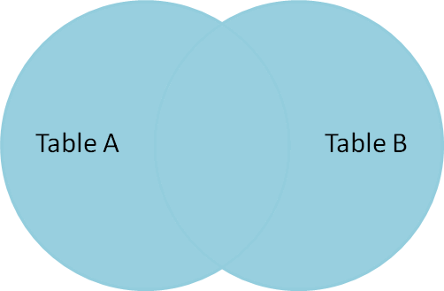

Exploring Data, Part 3
================
Damian Thomas
2016-09-30

Welcome & Setup
---------------

1.  Log in to network
2.  Update course materials from github
    -   <https://github.com/wampeh1/ECOG_314>

3.  Open lecture file in RStudio
    -   Lecture5.Rmd

------------------------------------------------------------------------

Midterm
-------

-   Schedule

Homework
--------

-   Feedback

Getting help online
-------------------

-   Cookbook R: <http://www.cookbook-r.com/Data_input_and_output/Loading_data_from_a_file/> - recipes for common tasks
-   Datacamp Tutorials: <https://www.datacamp.com/community/tutorials/importing-data-r-part-two>
-   Stack Overflow: <http://stackoverflow.com/questions/tagged/r> - searchable Q&A
-   R Bloggers: <https://www.r-bloggers.com/read-excel-files-from-r/> - brief posts with examples, links to other sites
-   [google](http://www.google.com) - is your friend

Free online books

-   Advanced R (<http://adv-r.had.co.nz/>)
-   R for Data Science (<http://r4ds.had.co.nz/>)

Resources
---------

<http://tryr.codeschool.com/>

<https://www.rstudio.com/online-learning/#R>

<http://adv-r.had.co.nz/>

<https://github.com/hadley/r4ds>

------------------------------------------------------------------------

Recap Lecture 3
---------------

-   Rstudio Interface
-   Managing Your Rstudio Session
-   R Object types
-   R syntax
    -   Object creation
    -   Object subsetting
    -   Expressions
    -   Functions
-   Reading Data
-   Viewing Data
-   Running Code - hello.R

------------------------------------------------------------------------

Recap Lecture 4
---------------

### Data Set Categories

Data sets fall into 3 major categories:

-   *cross sectional*
-   *time series*
-   *panel or longitudinal*

### Analysis Workflow


(Image source: [R for Data Science](http://r4ds.had.co.nz/))

This framework is useful for organizing our efforts. In this session we will practice importing data, cleaning data, and transforming it to help us answer (and generate) questions with plots.

### Tasks

-   Import data
-   Create and alter variables
-   Compute summary statistics
-   Subset observations
    -   and compute aggregates for subsets
-   Visualize data
-   Merge data sets
-   Transform data (restucture)

### Tools

#### Base R

-   Import:
    -   read.table(), and related functions
-   Aggregations:
    -   summary()
    -   mean()
    -   median()
    -   sd() & var()
    -   min() & max
    -   sum()
    -   length()
-   Transformations
    -   ifelse()
    -   sub() & gsub()
    -   lag()
    -   merge()
    -   subset()
-   Visualization
    -   plot()
    -   hist()
    -   etc.

#### Tidyverse alternatives

-   dplyr
-   reshape2
-   ggplot2

------------------------------------------------------------------------

Lecture 5: Exploring Data, Part 3
=================================

Central Question
----------------

Which marvel characters generate the most movie revenue?

The plan is to combine data from several sources and compare the characters based on a series of revenue generation measures.

Source Data
-----------

From Wikipedia (<https://en.wikipedia.org/wiki/List_of_Marvel_Cinematic_Universe_films>) and IMDb (<http://www.imdb.com/list/ls036115103/>)

1.  an avengers team roster
    -   Each observation represents a single member of the team
    -   Variables (2): team member codename, and the total number of movies in the current

2.  revenue for each marvel movie
    -   Each observation represents a single movie
    -   Variables (3): the name of the movie, the total revenue, and the release date

3.  time on screen
    -   Each observation represents a movie appearance for a given character
    -   Variables (2): character name/codename, and text with the movie title and total screen time combined

### Avengers team roster

``` r
avengers <- read.csv("data/raw/avengers.csv", stringsAsFactors = FALSE)
avengers
```

    ##          codename movies
    ## 1        Iron Man      3
    ## 2            Hulk      1
    ## 3            Thor      2
    ## 4 Captain America      3
    ## 5         Hawkeye      0
    ## 6     Black Widow      0

``` r
str(avengers)
```

    ## 'data.frame':    6 obs. of  2 variables:
    ##  $ codename: chr  "Iron Man" "Hulk" "Thor" "Captain America" ...
    ##  $ movies  : int  3 1 2 3 0 0

### Movie Revenue

``` r
movies <- read.delim("data/raw/movies.txt", sep = "|", stringsAsFactors = FALSE)
movies
```

    ##                                  title        revenue         released
    ## 1                             Iron Man   $585,174,222      May 2, 2008
    ## 2                  The Incredible Hulk   $263,427,551    June 13, 2008
    ## 3                           Iron Man 2   $623,933,331      May 7, 2010
    ## 4                                 Thor   $449,326,618      May 6, 2011
    ## 5   Captain America: The First Avenger   $370,569,774    July 22, 2011
    ## 6                Marvel's The Avengers $1,519,557,910      May 4, 2012
    ## 7                           Iron Man 3 $1,215,439,994      May 3, 2013
    ## 8                 Thor: The Dark World   $644,602,516 November 8, 2013
    ## 9  Captain America: The Winter Soldier   $714,421,503    April 4, 2014
    ## 10             Guardians of the Galaxy   $773,312,399   August 1, 2014
    ## 11             Avengers: Age of Ultron $1,405,413,868      May 1, 2015
    ## 12                             Ant-Man   $519,445,163    July 17, 2015
    ## 13          Captain America: Civil War $1,152,745,930      May 6, 2016

``` r
str(movies)
```

    ## 'data.frame':    13 obs. of  3 variables:
    ##  $ title   : chr  "Iron Man" "The Incredible Hulk" "Iron Man 2" "Thor" ...
    ##  $ revenue : chr  "$585,174,222" "$263,427,551" "$623,933,331" "$449,326,618" ...
    ##  $ released: chr  "May 2, 2008" "June 13, 2008" "May 7, 2010" "May 6, 2011" ...

### Screen time

``` r
screen_time <- read.delim("data/raw/screen_time.txt", sep = "\t", header = FALSE, stringsAsFactors = FALSE)
head(screen_time, 25)
```

    ##                  V1                                            V2
    ## 1        Tony Stark                            * IRON MAN <77:15>
    ## 2        Tony Stark                   * THE INCREDIBLE HULK <:30>
    ## 3        Tony Stark                          * IRON MAN 2 <61:15>
    ## 4        Tony Stark                        * THE AVENGERS <32:15>
    ## 5        Tony Stark                          * IRON MAN 3 <62:15>
    ## 6        Tony Stark             * AVENGERS: AGE OF ULTRON <27:15>
    ## 7        Tony Stark          * CAPTAIN AMERICA: CIVIL WAR <33:45>
    ## 8   Captain America  * CAPTAIN AMERICA: THE FIRST AVENGER <56:30>
    ## 9   Captain America                        * THE AVENGERS <28:15>
    ## 10  Captain America    * CAPTAIN AMERICA: THE WINTER SOLDIER <59>
    ## 11  Captain America             * AVENGERS: AGE OF ULTRON <21:45>
    ## 12  Captain America                       * ANT-MAN (cameo) <:15>
    ## 13  Captain America             * CAPTAIN AMERICA: CIVIL WAR <36>
    ## 14             Thor                                * THOR <43:15>
    ## 15             Thor                           * THE AVENGERS <18>
    ## 16             Thor                   * THOR: THE DARK WORLD <35>
    ## 17             Thor             * AVENGERS: AGE OF ULTRON <13:15>
    ## 18     Bruce Banner                 * THE INCREDIBLE HULK <51:45>
    ## 19     Bruce Banner                        * THE AVENGERS <22:15>
    ## 20     Bruce Banner                    * IRON MAN 3 (cameo) <:45>
    ## 21     Bruce Banner                * AVENGERS: AGE OF ULTRON <20>
    ## 22 Natasha Romanoff                           * IRON MAN 2 <9:15>
    ## 23 Natasha Romanoff                        * THE AVENGERS <24:45>
    ## 24 Natasha Romanoff * CAPTAIN AMERICA: THE WINTER SOLDIER <24:45>
    ## 25 Natasha Romanoff                * AVENGERS: AGE OF ULTRON <18>

``` r
str(screen_time)
```

    ## 'data.frame':    72 obs. of  2 variables:
    ##  $ V1: chr  "Tony Stark" "Tony Stark" "Tony Stark" "Tony Stark" ...
    ##  $ V2: chr  "* IRON MAN <77:15>" "* THE INCREDIBLE HULK <:30>" "* IRON MAN 2 <61:15>" "* THE AVENGERS <32:15>" ...

------------------------------------------------------------------------

### Tidy and Transform

What is the state of the data? Tidy? Ready for plotting and analysis? Not quite.

-   avengers data frame
    -   Need to reformat codename for merging
-   movies data frame
    -   The revenue and date variables are text (can't do math or sort in a meaningful order)
    -   No shared identifier for merging
-   screen\_time data frame
    -   No variable names
    -   Multiple bits information in single text variable
    -   No shared identifier for merging

Code to accomplish these tasks is included in the course repository. We will examine the programs separately

``` r
source("clean_avengers_data.R", echo = FALSE)
```

``` r
source("clean_movies_data.R", echo = FALSE)
```

``` r
source("clean_screen_time_data.R", echo = FALSE)
```

### Visualize

Once we have clean data sets, we can explore with plots and summaries

#### Visualize - Avengers roster

``` r
source("plot_avengers_data.R", echo = FALSE)
```


### Questions

-   How many movies have been made?
-   Average number of movies?
-   Who has the most movies?

``` r
# Movies made
sum(avengers$movies)

# Average
mean(avengers$movies)

# Most movies, multiple methods
avengers[ avengers$movies == max(avengers$movies), ]      # conditional subset with "["

subset(avengers, avengers$movies == max(avengers$movies)) # conditional subset with function

tail( avengers[ order(avengers$movies),], 3)              # ordered subset or observations
```

#### Answers

-   How many movies have been made with the 6 primary avengers? 9
-   Average number of movies per member? 1.5
-   Who has the most movies?\* It's a tie: iron man, captain america
-   Which character is most successful? Hard to tell without more data.

#### Visualize - Movie Revenue

``` r
source("plot_movies_data.R", echo = FALSE)
```


#### Questions (movie revenues)

-   How many movies have been made?

-   Average revenue?

-   Which movie made the least?

### Transform -- aggregate

-   Which avenger made the most money?

#### Base R

``` r
# Give non-avengers a single label
df <- movies
df[is.na(movies$codename), "codename"] <- "other"

# sum revenue
aggregated <- with(df,
     
     aggregate(revenue, by = list(codename), FUN = "sum")
)

# results
names(aggregated) <- c("codename", "total_revenue")  # name variables

aggregated
```

    ##          codename total_revenue
    ## 1 captain america     2237.7372
    ## 2            hulk      263.4276
    ## 3        iron man     2424.5475
    ## 4           other     4217.7293
    ## 5            thor     1093.9291

#### dplyr library functions

Same thing, using dplyr

``` r
aggregated <- movies %>% 
    
    mutate(codename = ifelse(is.na(codename), "other", codename)) %>%
    
    group_by(codename) %>%
    
    summarise(total_revenue     = sum(revenue),
              total_appearances = n()          ) %>%
    
    data.frame()

aggregated
```

    ##          codename total_revenue total_appearances
    ## 1 captain america     2237.7372                 3
    ## 2            hulk      263.4276                 1
    ## 3        iron man     2424.5475                 3
    ## 4           other     4217.7293                 4
    ## 5            thor     1093.9291                 2

#### Answers (movies)

-   How many movies have been made?13
-   Total revenue? : 10.2 billion
-   Average revenue? 787 million
-   Which movie made the least? the incredible hulk

#### Visualize - Screen Time

``` r
source("plot_screen_time_data.R", echo = FALSE)
```


------------------------------------------------------------------------

#### Summary Stats - screen time

``` r
summary(screen_time)
```

    ##      name              title              minutes           cameo        
    ##  Length:72          Length:72          Min.   : 0.250   Min.   :0.00000  
    ##  Class :character   Class :character   1st Qu.: 5.312   1st Qu.:0.00000  
    ##  Mode  :character   Mode  :character   Median :16.500   Median :0.00000  
    ##                                        Mean   :19.270   Mean   :0.09722  
    ##                                        3rd Qu.:24.917   3rd Qu.:0.00000  
    ##                                        Max.   :77.250   Max.   :1.00000  
    ##    codename           is_avenger    
    ##  Length:72          Min.   :0.0000  
    ##  Class :character   1st Qu.:0.0000  
    ##  Mode  :character   Median :0.0000  
    ##                     Mean   :0.4167  
    ##                     3rd Qu.:1.0000  
    ##                     Max.   :1.0000

``` r
sd(screen_time$minutes)
```

    ## [1] 17.5684

``` r
# Standard deviation for avengers
with( subset(screen_time, screen_time$is_avenger == 1),
      sd(minutes)
)
```

    ## [1] 20.88248

``` r
# average screen time for each avenger
df <- with( subset(screen_time, screen_time$is_avenger == 1),
      aggregate(minutes, by = list(codename), FUN = "mean")
)
names(df) <- c("codename", "average_minutes")
df
```

    ##          codename average_minutes
    ## 1     black widow        17.76000
    ## 2 captain america        33.88889
    ## 3         hawkeye         8.31250
    ## 4            hulk        23.77083
    ## 5        iron man        42.07143
    ## 6            thor        27.59583

``` r
#  total appearances for each avenger
df <- with( subset(screen_time, screen_time$is_avenger == 1),
      aggregate(codename, by = list(codename), FUN = "length")
)
names(df) <- c("codename", "total_appearances")
df
```

    ##          codename total_appearances
    ## 1     black widow                 5
    ## 2 captain america                 6
    ## 3         hawkeye                 4
    ## 4            hulk                 4
    ## 5        iron man                 7
    ## 6            thor                 4

Calculate with dplyr (alternative)

``` r
screen_time %>% 
    
    mutate(codename = ifelse(is.na(codename), "other", codename)) %>%
    
    group_by(codename) %>%
    
    summarise(total_minutes = sum(minutes),
              total_appearances = n(),
              avgerage_minutes = mean(minutes),
              sd_minutes = sd(minutes)) %>%
    
    arrange(desc(total_minutes)) %>%
    
    data.frame()
```

    ##           codename total_minutes total_appearances avgerage_minutes
    ## 1         iron man     294.50000                 7        42.071429
    ## 2  captain america     203.33333                 6        33.888889
    ## 3             thor     110.38333                 4        27.595833
    ## 4             hulk      95.08333                 4        23.770833
    ## 5      black widow      88.80000                 5        17.760000
    ## 6     pepper potts      63.55000                 4        15.887500
    ## 7             loki      60.25000                 3        20.083333
    ## 8       scott lang      55.25000                 2        27.625000
    ## 9      jane foster      46.76667                 2        23.383333
    ## 10       star-lord      46.75000                 1        46.750000
    ## 11    james rhodes      45.35000                 5         9.070000
    ## 12       nick fury      43.80000                 7         6.257143
    ## 13  winter soldier      42.98333                 4        10.745833
    ## 14         hawkeye      33.25000                 4         8.312500
    ## 15          gamora      31.51667                 1        31.516667
    ## 16      sam wilson      27.53333                 4         6.883333
    ## 17      betty ross      27.45000                 1        27.450000
    ## 18        hank pym      24.25000                 1        24.250000
    ## 19     erik selvig      24.05000                 4         6.012500
    ## 20  wanda maximoff      22.61667                 3         7.538889
    ##    sd_minutes
    ## 1   26.223683
    ## 2   22.406504
    ## 3   14.154723
    ## 4   21.031103
    ## 5    7.185959
    ## 6    8.006287
    ## 7    2.240722
    ## 8   32.350135
    ## 9    2.875568
    ## 10         NA
    ## 11   6.058527
    ## 12   7.524152
    ## 13   8.863913
    ## 14   6.868937
    ## 15         NA
    ## 16   6.544421
    ## 17         NA
    ## 18         NA
    ## 19   5.673825
    ## 20   6.393711

Merging
-------

merge() function

Combine the movie revenue data with the screen time data. Explore how variation in revenue might be related to character screen time.

------------------------------------------------------------------------

Merging - Demonstration
-----------------------

The Merge function combines observations from two data frames based on one (or more) shared identifiers.

``` r
?merge
```

#### Example data sets

``` r
warm_blooded <- read.table(header=TRUE, text='
animal teeth
cat    30
dog    42
bird   0
ape    32
')

four_legged <- read.table(header=TRUE, text='
animal quiet
cat    TRUE
dog    FALSE
lizard TRUE
')
```

### Basic Merges

Images from [blog](https://blog.codinghorror.com/a-visual-explanation-of-sql-joins/)

Observations with matching identifiers in both


``` r
merge(warm_blooded, four_legged)
```

    ##   animal teeth quiet
    ## 1    cat    30  TRUE
    ## 2    dog    42 FALSE

``` r
merge(warm_blooded, four_legged, by = "animal")    # specify the identifier
```

    ##   animal teeth quiet
    ## 1    cat    30  TRUE
    ## 2    dog    42 FALSE

All Observations from X, matching observations from Y


``` r
merge(warm_blooded, four_legged, by = "animal", all.x = TRUE)
```

    ##   animal teeth quiet
    ## 1    ape    32    NA
    ## 2   bird     0    NA
    ## 3    cat    30  TRUE
    ## 4    dog    42 FALSE

Or the other way: all observations from Y, matching observations from X

``` r
merge(warm_blooded, four_legged, by = "animal", all.y = TRUE)
```

    ##   animal teeth quiet
    ## 1    cat    30  TRUE
    ## 2    dog    42 FALSE
    ## 3 lizard    NA  TRUE

All Observations



``` r
merge(warm_blooded, four_legged, by = "animal", all = TRUE)
```

    ##   animal teeth quiet
    ## 1    ape    32    NA
    ## 2   bird     0    NA
    ## 3    cat    30  TRUE
    ## 4    dog    42 FALSE
    ## 5 lizard    NA  TRUE

### Non-merges

All Observations from X, excluding matching observations from Y


``` r
subset(warm_blooded, ! warm_blooded$animal %in% four_legged$animal)
```

    ##   animal teeth
    ## 3   bird     0
    ## 4    ape    32

All Observations from Y, excluding matching observations from X

``` r
subset(four_legged, ! four_legged$animal %in% warm_blooded$animal)
```

    ##   animal quiet
    ## 3 lizard  TRUE

### Complex Merges -- Multiple Identifiers

Give the "by" parameter a vecor of column names

``` r
person <- read.table(header=TRUE, text='
firstname lastname real
tony      stark    FALSE
tony      montana  FALSE
joe       montana  TRUE
')

occupation <- read.table(header=TRUE, text='
firstname lastname description
tony      stark    engineer
tony      montana  kingpin
joe       montana  quarterback
')

merge(person, occupation, by = c("firstname", "lastname")) 
```

    ##   firstname lastname  real description
    ## 1       joe  montana  TRUE quarterback
    ## 2      tony  montana FALSE     kingpin
    ## 3      tony    stark FALSE    engineer

What happens if we don't?

-   Multiple observations match
-   Duplicate variable names

``` r
merge(person, occupation, by = "firstname") 
```

    ##   firstname lastname.x  real lastname.y description
    ## 1       joe    montana  TRUE    montana quarterback
    ## 2      tony      stark FALSE      stark    engineer
    ## 3      tony      stark FALSE    montana     kingpin
    ## 4      tony    montana FALSE      stark    engineer
    ## 5      tony    montana FALSE    montana     kingpin

Probably not what you wanted. This is known as a "many-to-many" join. There are useful applications. Such as computing distances among points

``` r
# Metro stations
stations <- read.table(header=TRUE, text='
west  north station     line
20 Q "Dupont Cir"       red
17 K "Farragut North"   red
4  F "Judiciary Sq"     red
')

# Approximate coordinates
stations$x <- stations$west
stations$y <- match(stations$north, LETTERS)

# Many-to-many merge
pairs <- merge(stations, stations, by = "line", suffixes = c("_from", "_to")) 

# straight line distance
pairs$distance <- sqrt( (pairs$x_from - pairs$x_to)^2 + (pairs$y_from - pairs$y_to)^2 )

# result
pairs[, c("station_from", "station_to", "distance")]
```

    ##     station_from     station_to  distance
    ## 1     Dupont Cir     Dupont Cir  0.000000
    ## 2     Dupont Cir Farragut North  6.708204
    ## 3     Dupont Cir   Judiciary Sq 19.416488
    ## 4 Farragut North     Dupont Cir  6.708204
    ## 5 Farragut North Farragut North  0.000000
    ## 6 Farragut North   Judiciary Sq 13.928388
    ## 7   Judiciary Sq     Dupont Cir 19.416488
    ## 8   Judiciary Sq Farragut North 13.928388
    ## 9   Judiciary Sq   Judiciary Sq  0.000000

------------------------------------------------------------------------

Merging - Applied to the Avengers Question
------------------------------------------

Compute the total on-screen time per movie

``` r
total_screen_time <- aggregate(screen_time$minutes, by = list(screen_time$title), "sum")
names(total_screen_time) <- c("title", "total_minutes")
total_screen_time
```

    ##                                  title total_minutes
    ## 1                              ant-man      77.28333
    ## 2              avengers: age of ultron     135.38333
    ## 3           captain america: civil war     139.71667
    ## 4   captain america: the first avenger      65.13333
    ## 5  captain america: the winter soldier     127.98333
    ## 6              guardians of the galaxy      78.26667
    ## 7                             iron man     109.00000
    ## 8                           iron man 2     112.25000
    ## 9                           iron man 3      91.05000
    ## 10                        the avengers     185.85000
    ## 11                 the incredible hulk      79.70000
    ## 12                                thor     100.85000
    ## 13                thor: the dark world      85.00000

Compute share of screen time per character.

-   one-to-many merge: information repeated

``` r
df <- merge(screen_time, total_screen_time, by = "title")
df$minutes_share <- df$minutes / df$total_minutes
head(df)
```

    ##                     title            name   minutes cameo        codename
    ## 1                 ant-man  winter soldier  0.250000     1  winter soldier
    ## 2                 ant-man captain america  0.250000     1 captain america
    ## 3                 ant-man      scott lang 50.500000     0      scott lang
    ## 4                 ant-man      sam wilson  2.033333     0      sam wilson
    ## 5                 ant-man        hank pym 24.250000     0        hank pym
    ## 6 avengers: age of ultron    bruce banner 20.333333     0            hulk
    ##   is_avenger total_minutes minutes_share
    ## 1          0      77.28333    0.00323485
    ## 2          1      77.28333    0.00323485
    ## 3          0      77.28333    0.65343972
    ## 4          0      77.28333    0.02631011
    ## 5          0      77.28333    0.31378046
    ## 6          1     135.38333    0.15019082

Compute share of revenue

-   one-to-many merge

``` r
df <- merge(df, movies[, c("title", "revenue")], by = "title")

df$revenue_share <- df$revenue * df$minutes_share
head(df)
```

    ##                     title            name   minutes cameo        codename
    ## 1                 ant-man  winter soldier  0.250000     1  winter soldier
    ## 2                 ant-man captain america  0.250000     1 captain america
    ## 3                 ant-man      scott lang 50.500000     0      scott lang
    ## 4                 ant-man      sam wilson  2.033333     0      sam wilson
    ## 5                 ant-man        hank pym 24.250000     0        hank pym
    ## 6 avengers: age of ultron    bruce banner 20.333333     0            hulk
    ##   is_avenger total_minutes minutes_share   revenue revenue_share
    ## 1          0      77.28333    0.00323485  519.4452      1.680327
    ## 2          1      77.28333    0.00323485  519.4452      1.680327
    ## 3          0      77.28333    0.65343972  519.4452    339.426104
    ## 4          0      77.28333    0.02631011  519.4452     13.666662
    ## 5          0      77.28333    0.31378046  519.4452    162.991743
    ## 6          1     135.38333    0.15019082 1405.4139    211.080256

``` r
with(df,
     
     plot(minutes_share, 
          revenue_share, 
          main = "Movie Revenue Share vs Screen Time Share")
     
)
```


``` r
average_share <- aggregate(df$revenue_share, by = list(df$codename), "mean")
names(average_share) <- c("codename", "average_revenue")

average_share[order(-average_share$average_revenue),]
```

    ##           codename average_revenue
    ## 17       star-lord       461.91254
    ## 9         iron man       344.69100
    ## 5           gamora       311.39986
    ## 3  captain america       236.11752
    ## 16      scott lang       189.30822
    ## 18            thor       187.42948
    ## 6         hank pym       162.99174
    ## 11     jane foster       143.93574
    ## 8             hulk       143.51501
    ## 2      black widow       135.77054
    ## 12            loki       134.39301
    ## 14    pepper potts       125.79358
    ## 1       betty ross        90.72881
    ## 7          hawkeye        75.99389
    ## 20  winter soldier        74.51695
    ## 10    james rhodes        70.98931
    ## 19  wanda maximoff        70.64159
    ## 15      sam wilson        46.90731
    ## 13       nick fury        43.64311
    ## 4      erik selvig        35.81954
