Charting: The Good, the Bad, and the Ugly
========================================================
author: Tom Allard
date: 2016-11-04
autosize: true

Why chart?
========================================================
type: prompt

  * We make charts to communicate ideas.
  * A good chart must be:
    * Easy to read
    * Communicate your idea
    * Everything to understand the chart must be present (do not expect your audience to read all your text before they look at your chart)
    * Not mislead (intentionally or not)

Ugly Charts
========================================================
type: sub-section

  * Charts that are difficult to understand
    * Unlabeled axis
    * Indistinguisable colors
    * Nonsensical

Poor Color, Inconsistent X Scale
========================================================

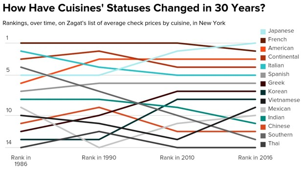

Venn Diagram Done Wrong
========================================================

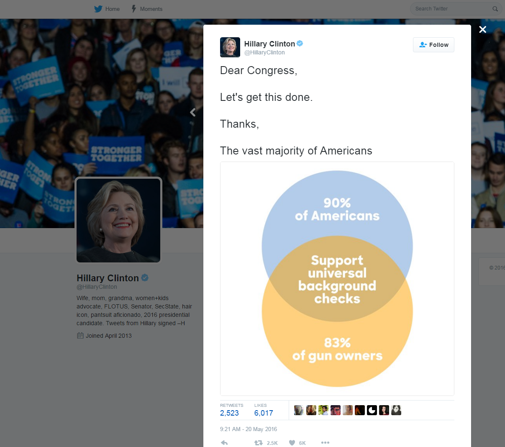

Venn Diagram Done Right
========================================================

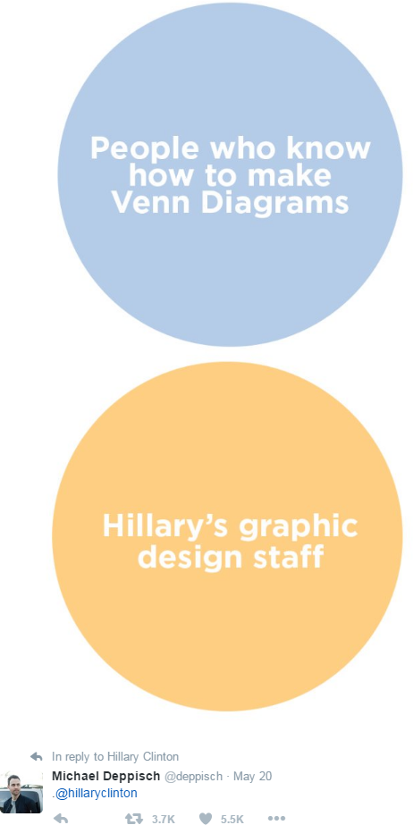

Pie Charts
========================================================

  * Pie charts are almost inherently bad
  * They can be aesthetically pleasing, but not accurately convey information
    * Thin slices are hard to discern
    * Difficult to compare when there are many slices
  * 3D Pie Charts are ALWAYS wrong
    * Humans will interpret volume, not area
    * The angle of view will distort the only real information

Time Series Pie Chart
========================================================

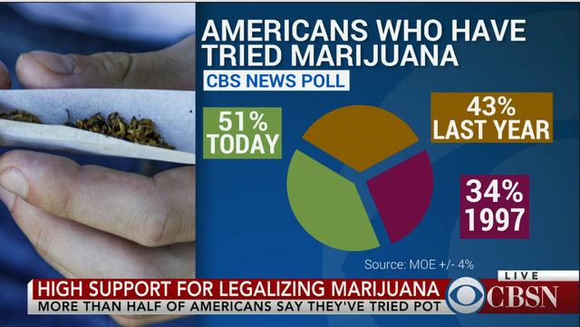

The D Pie Chart
========================================================

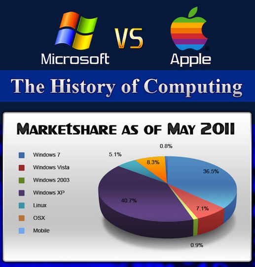

Bad Charts
========================================================
type: sub-section

  * Charts that distort the truth (intentionally or not)

Lying with Bar Charts
========================================================

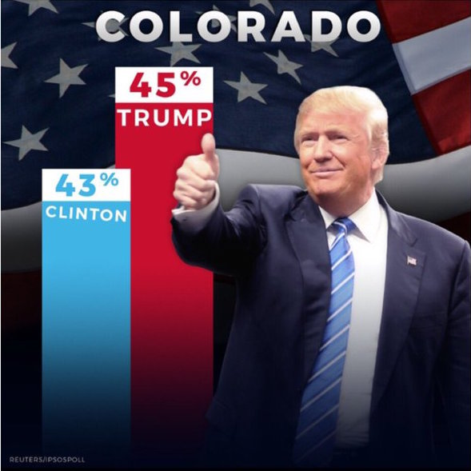

How To Lie With Bar Charts
========================================================

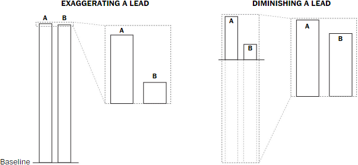

Source: Washington Post, "Most of Trumps charts skew the data. And not always in his favor."
https://www.washingtonpost.com/graphics/politics/2016-election/trump-charts/

The Trump Chart, fixed
========================================================

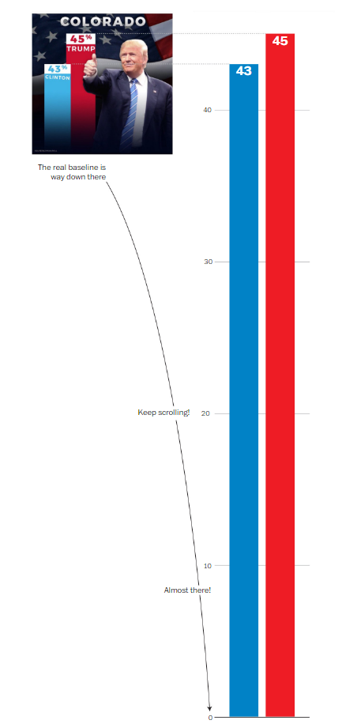

Distorting the X Axis
========================================================

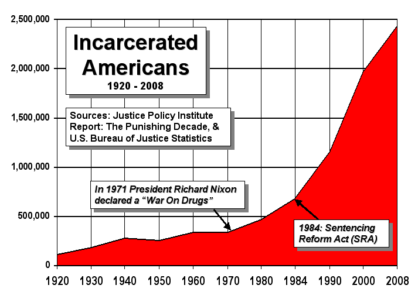

Just... wrong
========================================================

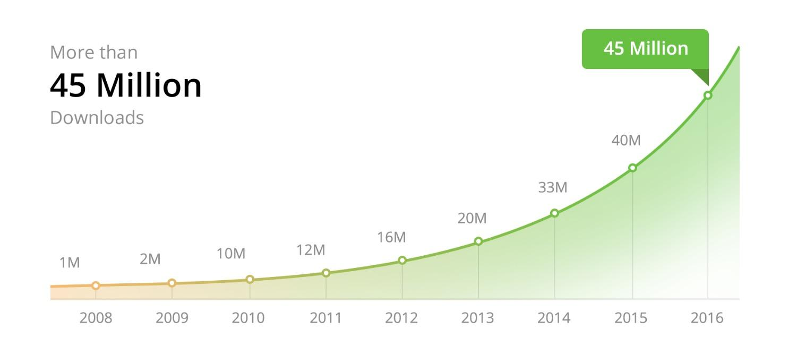

The Real Numbers
========================================================

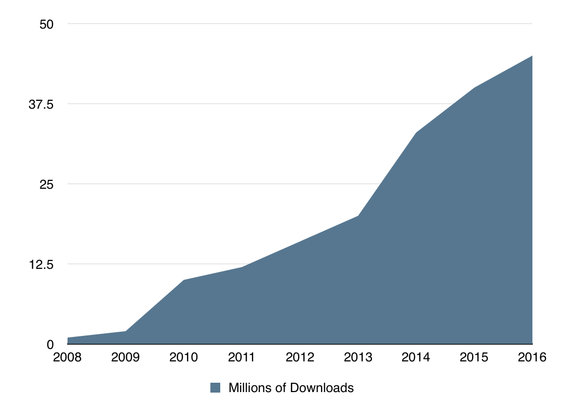

Dual Y Axis
========================================================

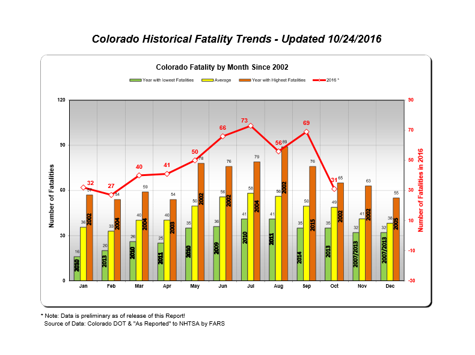

Are dual-scaled graphs ever good?
========================================================

Dual-Scaled Axes in Graphs: Are They Ever the Best Solution? http://bit.ly/2e5oZle

> I certainly cannot conclude, once and for all, that graphs with dual-scaled axes are never useful; only that I cannot think of a situation that warrants them in light of other, better solutions. I invite you to propose viable exceptions, which I will welcome with open arms.

Dual axes time series plots may be ok sometimes after all: http://bit.ly/2ehQJyj

Five problems (and one solution) with dual-axis time series plots: http://bit.ly/2ersxgh

Dual axes time series plots with various more awkward data: http://bit.ly/2ehSyvs
