Charting
================
Tom Allard
2016-11-04

Introduction to ggplot
======================

The package is actually called `ggplot2`, although the function is called `ggplot`:

``` r
library(ggplot2)
```

Many other packages have extended the basic `plot` function, but `ggplot` is built from the ground up. It was designed to create a *general* approach to plotting (including theming). Included in the package is the building blocks for unlimited extensibility (beyond the scope of this lecture). A primary reason for teaching `ggplot` rather than base `plot` is that google will find more examples and help with `ggplot` over anything else.

`ggplot` has its own grammer that is distinctly different from most of what you've seen in R, but it is consistent and, once you understand it, becomes much easier to work with. `ggplot` takes a layered approach, so you can think of every step as another procedure. The fundamental layers are:

-   Aesthetics (`aes`) -- Mapping input data to display
-   Geometry (`geom`) -- Use the mappings to generate shapes
-   Statistics (`stat`) -- Statistical transformations

ggplot
------

We can start with a simple histogram and compare the base graphics function `hist` to using `ggplot`.

Included in `R` are several sample datasets. We'll use `mtcars` in this example:

``` r
head(mtcars)
```

    OUTPUT>                     mpg cyl disp  hp drat    wt  qsec vs am gear carb
    OUTPUT>  Mazda RX4         21.0   6  160 110 3.90 2.620 16.46  0  1    4    4
    OUTPUT>  Mazda RX4 Wag     21.0   6  160 110 3.90 2.875 17.02  0  1    4    4
    OUTPUT>  Datsun 710        22.8   4  108  93 3.85 2.320 18.61  1  1    4    1
    OUTPUT>  Hornet 4 Drive    21.4   6  258 110 3.08 3.215 19.44  1  0    3    1
    OUTPUT>  Hornet Sportabout 18.7   8  360 175 3.15 3.440 17.02  0  0    3    2
    OUTPUT>  Valiant           18.1   6  225 105 2.76 3.460 20.22  1  0    3    1

``` r
plot(mtcars$mpg,mtcars$wt)
```

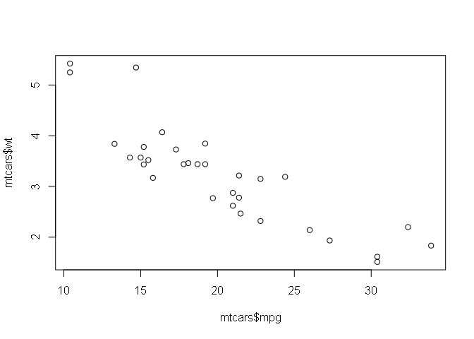

``` r
library(ggplot2)
ggplot(mtcars,
       aes(x=mpg,y=wt)) +
  geom_point()
```

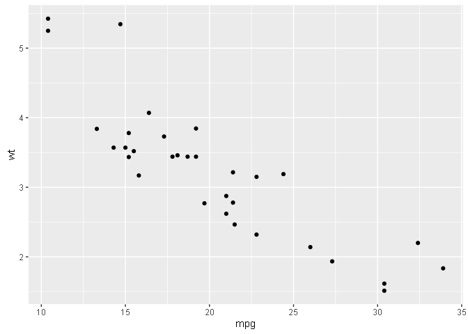

In `ggplot`, we often build an object and then add to it (with the "+" syntax). We can then "plot" the object (which will happen by default when you just type the object's name):

``` r
myPlot <- ggplot(mtcars,aes(x=mpg,y=wt))
myPlot <- myPlot + geom_point()
plot(myPlot)
```


Statistics
----------

Let's add some statistics:

``` r
# Note that I am creating a new plot  The original (myPlot) is unchanged
smoothPlot <- myPlot + geom_smooth()
plot(smoothPlot)
```

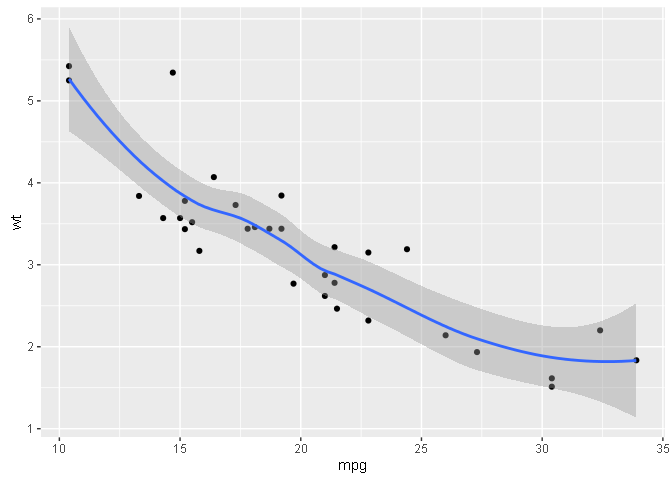

Additionally, we can specify the method for smoothing:

``` r
# Here I am re-using the original plot (myPlot)
lmPlot <- myPlot + geom_smooth(method="lm")
plot(lmPlot)
```

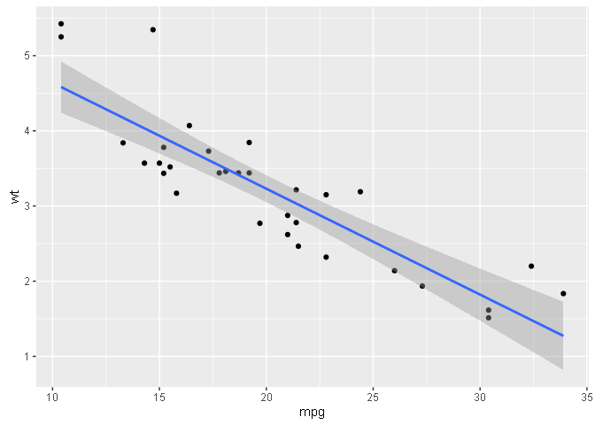

Density
-------

Instead of plotting points, we can plot kernel density using a different shape:

``` r
densityPlot <- ggplot(mtcars,aes(x=mpg)) +
  geom_density()
plot(densityPlot)
```

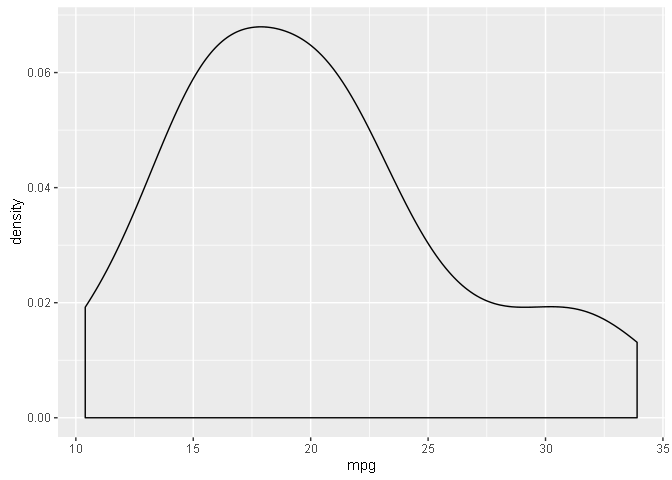

Grouping data
-------------

Let's group by gears:

``` r
# Number of gears is an integer, but we want to make it a label
mtcars$gear
```

    OUTPUT>   [1] 4 4 4 3 3 3 3 4 4 4 4 3 3 3 3 3 3 4 4 4 3 3 3 3 3 4 5 5 5 5 5 4

``` r
mtcars$gearLabel <- factor(mtcars$gear,levels=c(3,4,5),
    labels=c("3 gears","4 gears","5 gears")) 
mtcars$gearLabel
```

    OUTPUT>   [1] 4 gears 4 gears 4 gears 3 gears 3 gears 3 gears 3 gears 4 gears
    OUTPUT>   [9] 4 gears 4 gears 4 gears 3 gears 3 gears 3 gears 3 gears 3 gears
    OUTPUT>  [17] 3 gears 4 gears 4 gears 4 gears 3 gears 3 gears 3 gears 3 gears
    OUTPUT>  [25] 3 gears 4 gears 5 gears 5 gears 5 gears 5 gears 5 gears 4 gears
    OUTPUT>  Levels: 3 gears 4 gears 5 gears

``` r
# Add an aesthetic "fill" and ggplot will color based on the variable
gearPlot <- ggplot(mtcars,aes(x=mpg)) +
  geom_density(aes(fill=gearLabel))
plot(gearPlot)
```

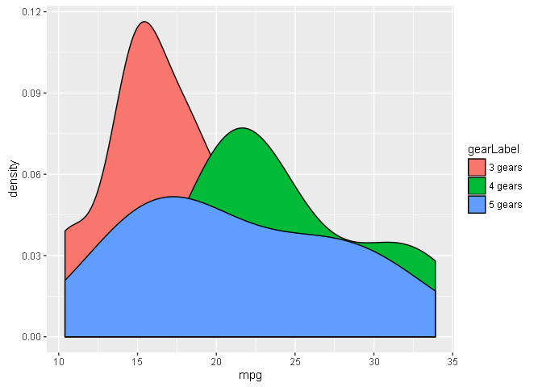

``` r
# Use "alpha" to make the colors transparent.
#   transparent  0  ... 1 solid
gearPlot <- ggplot(mtcars,aes(x=mpg)) +
  geom_density(aes(fill=gearLabel),alpha=.5)
plot(gearPlot)
```

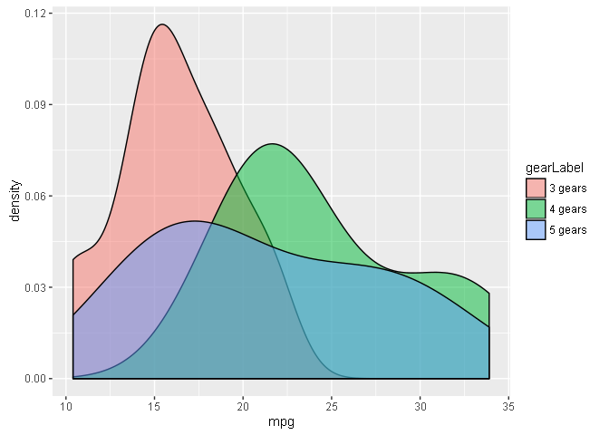

Labels
------

Now let's add some better labels and a title!

``` r
gearPlot <- gearPlot +
  labs(x="Miles Per Gallon",
       y="Density",
       fill="Gears") +
  ggtitle("Distribution of Gas Mileage (by Gears)")
plot(gearPlot)
```

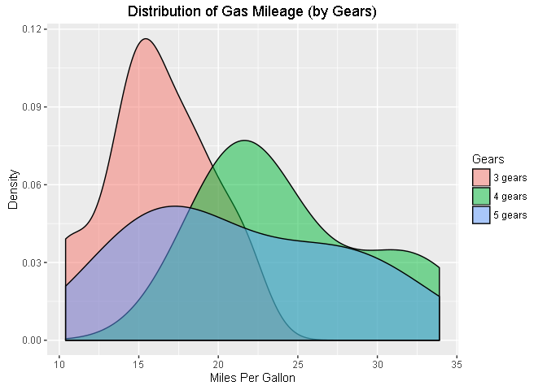

Themes
------

You can use `ggtheme` to set the general aspect of the chart:

``` r
?ggtheme
```

``` r
plot(gearPlot + theme_bw() + ggtitle("theme_bw()"))
```

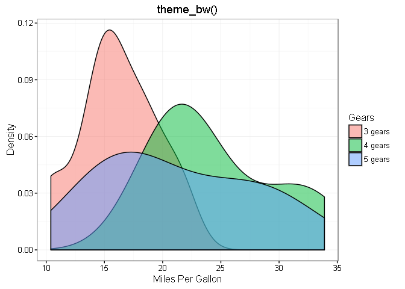

``` r
plot(gearPlot + theme_void() + ggtitle("theme_void()"))
```

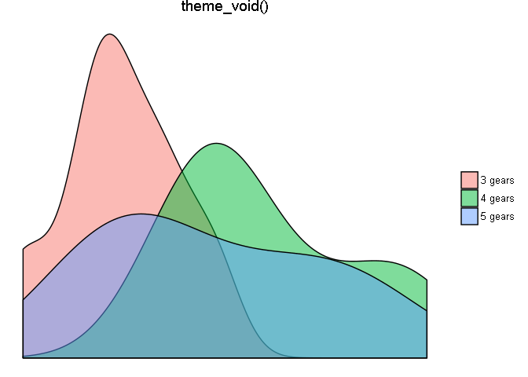

``` r
plot(gearPlot + theme_dark() + ggtitle("theme_dark()"))
```

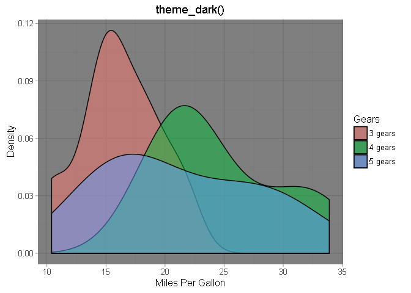

``` r
# More themes in the ggthemes package
library(ggthemes)
plot(gearPlot + theme_excel() + ggtitle("theme_excel()"))
```

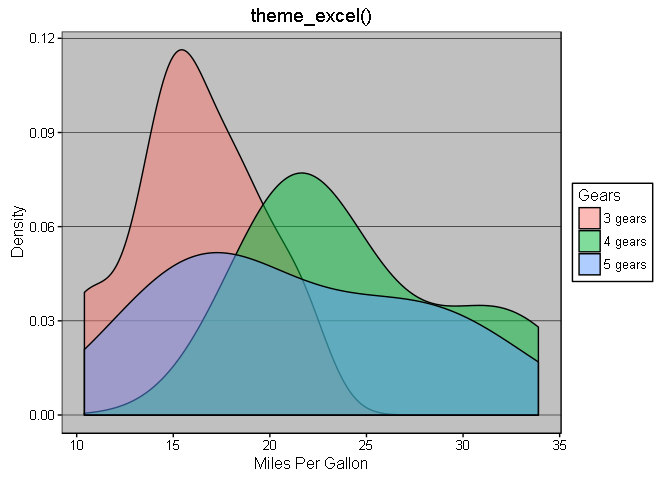

``` r
plot(gearPlot + theme_wsj() + ggtitle("theme_wsj()"))
```

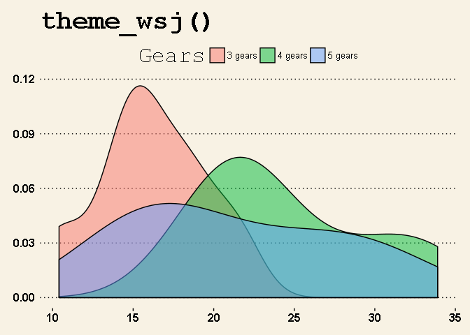

Facets
------

In some circumstances we want to plot relationships between set variables in multiple subsets of the data with the results appearing as panels in a larger figure. This is a known as a facet plot. This is a very useful feature of ggplot2. The faceting is defined by a categorical variable or variables. Each panel plot corresponds to a set value of the variable.

``` r
# Like gears, we want transmission and cylinders to be labels
mtcars$Transmission <- factor(mtcars$am,levels=c(0,1),
    labels=c("Automatic","Manual")) 
mtcars$Cylinders <- factor(mtcars$cyl,levels=c(4,6,8),
   labels=c("4 cyl","6 cyl","8 cyl")) 

# First, create the basic scatter plot
facetPlot <- ggplot(mtcars,aes(x=hp,y=mpg)) + 
  labs(y = "Miles Per Gallon",
       x = "Horse Power") +
  geom_point()
plot(facetPlot)
```

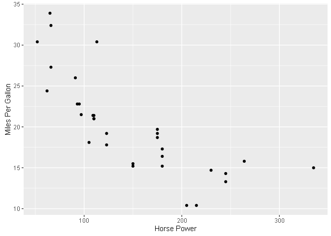

``` r
# Next, add color and shape by transmission
facetPlot <- ggplot(mtcars,aes(x=hp,y=mpg,
                               color=Transmission,
                               shape=Transmission)) + 
  labs(y = "Miles Per Gallon",
       x = "Horse Power") +
  geom_point()
plot(facetPlot)
```

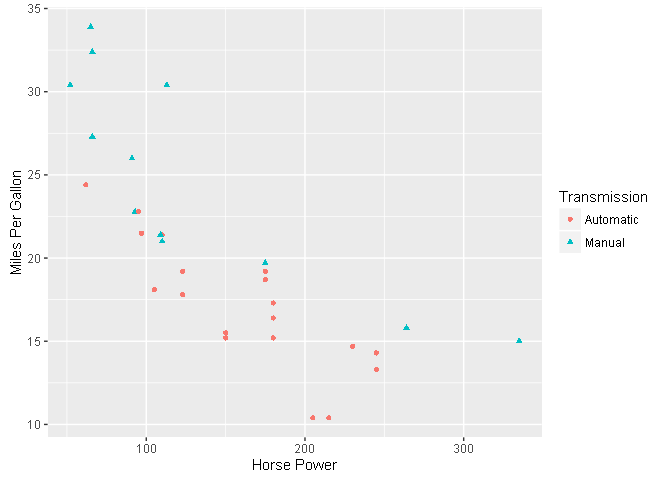

``` r
# Now add facets
#   (The drop=FALSE option tells ggplot to show every comination, even
#   when there is no data).
facetPlot <- facetPlot + 
  facet_grid(facets=gearLabel~Cylinders) +
  ggtitle("MPG vs HP (by Gears & Cylinders)")
       
plot(facetPlot)
```

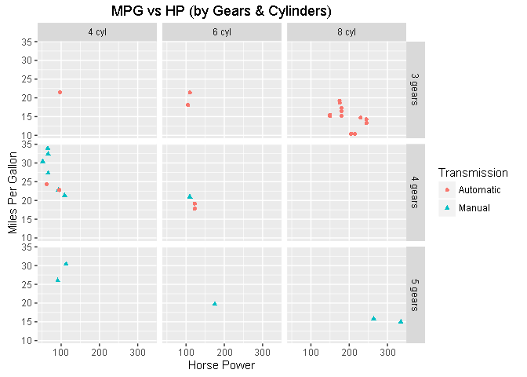

Separate regressions on a single plot
-------------------------------------

``` r
regPlot <- ggplot(mtcars,aes(x=wt,y=mpg,color=Cylinders)) +
  labs(y = "Miles Per Gallon",
       x = "Weight") +
  geom_point()
plot(regPlot)
```

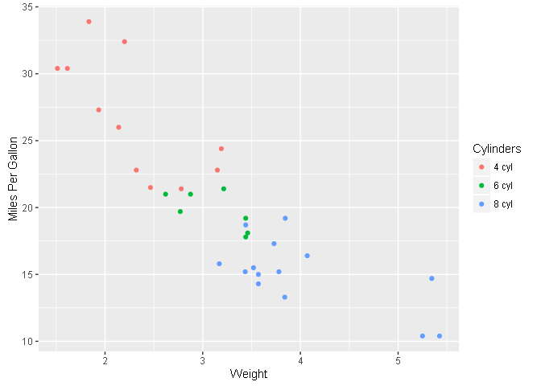

``` r
regPlot <- regPlot +
  geom_smooth(method="lm") +
  ggtitle("Regression of MPG on Weight") +
  theme_economist()
plot(regPlot)
```

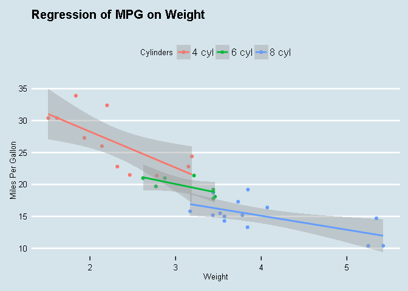

Timeseries data
---------------

The `quantmod` package includes `getSymbols()`, which can load data from the St. Louis Federal Reserve Bank's FRED database. We'll grab the federal funds rate and the 20-year Treasury Constant Maturity rate:

<https://fred.stlouisfed.org/series/FEDFUNDS> <https://fred.stlouisfed.org/series/GS20>

``` r
library(quantmod)
getSymbols(c("FEDFUNDS","GS20"),src="FRED")
```

    OUTPUT>  [1] "FEDFUNDS" "GS20"

``` r
head(FEDFUNDS)
```

    OUTPUT>             FEDFUNDS
    OUTPUT>  1954-07-01     0.80
    OUTPUT>  1954-08-01     1.22
    OUTPUT>  1954-09-01     1.06
    OUTPUT>  1954-10-01     0.85
    OUTPUT>  1954-11-01     0.83
    OUTPUT>  1954-12-01     1.28

``` r
head(GS20)
```

    OUTPUT>             GS20
    OUTPUT>  1953-04-01 3.08
    OUTPUT>  1953-05-01 3.18
    OUTPUT>  1953-06-01 3.21
    OUTPUT>  1953-07-01 3.12
    OUTPUT>  1953-08-01 3.10
    OUTPUT>  1953-09-01 3.07

``` r
# cbind() joins two tables by column.
# fortify() creates date as a variable that can be passed to ggplot.
FF.TCM20 <- fortify(cbind(FEDFUNDS,GS20))
head(FF.TCM20)
```

    OUTPUT>         Index FEDFUNDS GS20
    OUTPUT>  1 1953-04-01       NA 3.08
    OUTPUT>  2 1953-05-01       NA 3.18
    OUTPUT>  3 1953-06-01       NA 3.21
    OUTPUT>  4 1953-07-01       NA 3.12
    OUTPUT>  5 1953-08-01       NA 3.10
    OUTPUT>  6 1953-09-01       NA 3.07

Now that we have some timeseries data, we can plot it:

``` r
tsPlot <- ggplot() +
  geom_line(data=FF.TCM20,
            aes(x=Index,y=FEDFUNDS,
                color = "Federal Funds")) +
  geom_line(data=FF.TCM20,
            aes(x=Index,y=GS20,
                color = "20-Year TCM"))
plot(tsPlot)
```

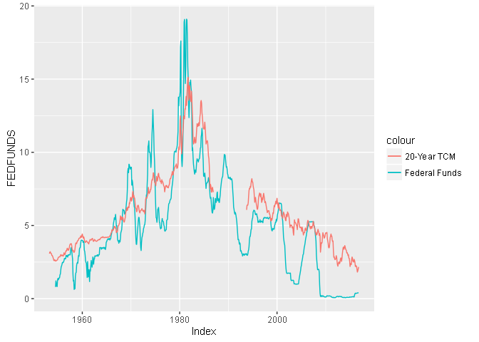

Now, there's still several things wrong with this:

-   The Y-axis is labeled "FEDFUNDS"
-   The X-axis is labeled "Index"
-   There aren't enough dates labeled
-   We're showing 60 years of monthly data
-   The legend has a weird label

``` r
# xlim and ylim control the limits of the x- and y-axes.
# Instead of using one of the packages themes, just make our own changes
tsPlot <- tsPlot +
  labs(x="",y="Percent") +
  xlim(as.Date('1995-01-01'),as.Date('2015-12-31')) +
  ylim(0,10) +
  theme(legend.position="bottom", 
        legend.direction="horizontal",
        legend.title=element_blank()) +
  ggtitle("Federal Funds vs 20-Year Treasury Constant Maturity (TCM)")
plot(tsPlot)
```

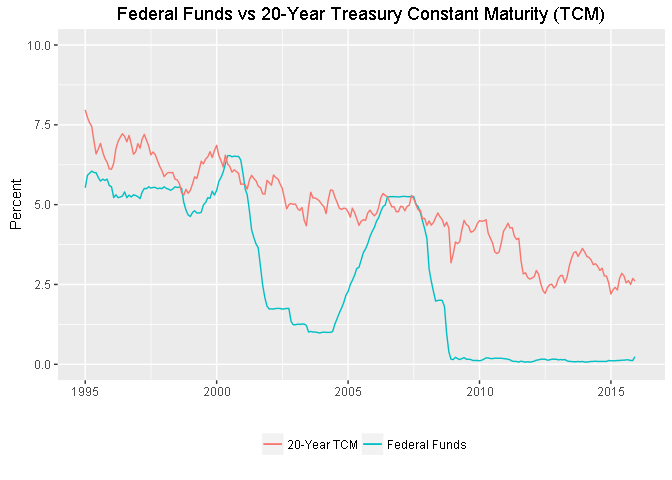

Log scale
---------

When variables span several orders of magnitude, a log scale is appropriate.

``` r
getSymbols("GDP",src="FRED")
```

    OUTPUT>  [1] "GDP"

``` r
gdpPlot <- ggplot() +
  geom_line(data=fortify(GDP),aes(x=Index,y=GDP/1000)) +
  labs(x="",y="$ tril") +
  ggtitle("US GDP")
plot(gdpPlot)
```

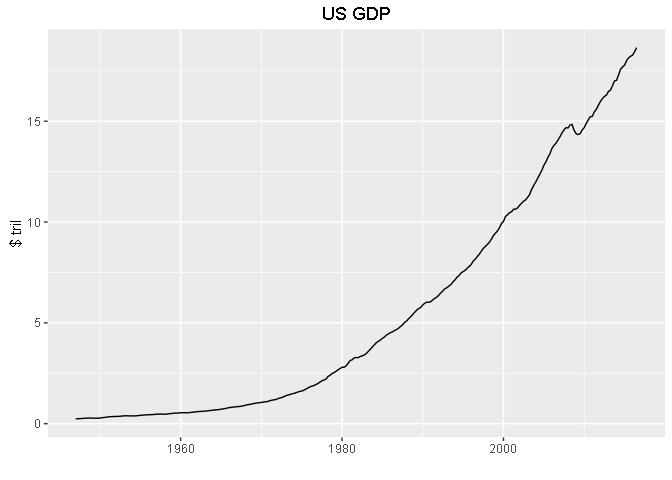

``` r
logPlot <- gdpPlot +
  scale_y_log10() +
  scale_x_date(date_breaks="10 years",
               date_labels = "%Y",
               expand=c(0,0),
               limits = as.Date(c("1945-01-01","2016-12-31
                                  
                                  "))) +
  theme_gdocs()
plot(logPlot)
```

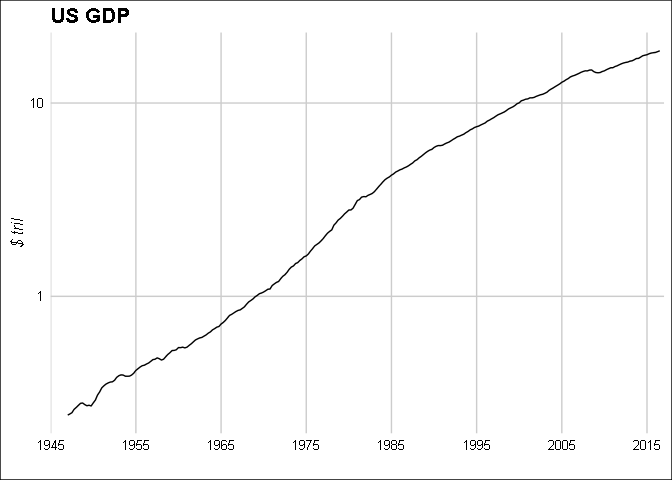

Other plotting packages
=======================

dygraphs
--------

`dygraphs` is a useful charting package for data exploration because you can quickly plot a timeseries and see the exact data points as well as zoom in:

``` r
library(dygraphs)
# Use dplyr's pipe and add dygraph's dyRangeSelector()
library(dplyr)
dygraph(cbind(FEDFUNDS,GS20)) %>% 
  dyRangeSelector()
```

<!--html_preserve-->

<script type="application/json" data-for="htmlwidget-7b6b6fd60efebcdf8d4d">{"x":{"attrs":{"labels":["month","FEDFUNDS","GS20"],"legend":"auto","retainDateWindow":false,"axes":{"x":{"pixelsPerLabel":60}},"showRangeSelector":true,"rangeSelectorHeight":40,"rangeSelectorPlotFillColor":" #A7B1C4","rangeSelectorPlotStrokeColor":"#808FAB","interactionModel":"Dygraph.Interaction.defaultModel"},"scale":"monthly","annotations":[],"shadings":[],"events":[],"format":"date","data":[["1953-04-01T00:00:00.000Z","1953-05-01T00:00:00.000Z","1953-06-01T00:00:00.000Z","1953-07-01T00:00:00.000Z","1953-08-01T00:00:00.000Z","1953-09-01T00:00:00.000Z","1953-10-01T00:00:00.000Z","1953-11-01T00:00:00.000Z","1953-12-01T00:00:00.000Z","1954-01-01T00:00:00.000Z","1954-02-01T00:00:00.000Z","1954-03-01T00:00:00.000Z","1954-04-01T00:00:00.000Z","1954-05-01T00:00:00.000Z","1954-06-01T00:00:00.000Z","1954-07-01T00:00:00.000Z","1954-08-01T00:00:00.000Z","1954-09-01T00:00:00.000Z","1954-10-01T00:00:00.000Z","1954-11-01T00:00:00.000Z","1954-12-01T00:00:00.000Z","1955-01-01T00:00:00.000Z","1955-02-01T00:00:00.000Z","1955-03-01T00:00:00.000Z","1955-04-01T00:00:00.000Z","1955-05-01T00:00:00.000Z","1955-06-01T00:00:00.000Z","1955-07-01T00:00:00.000Z","1955-08-01T00:00:00.000Z","1955-09-01T00:00:00.000Z","1955-10-01T00:00:00.000Z","1955-11-01T00:00:00.000Z","1955-12-01T00:00:00.000Z","1956-01-01T00:00:00.000Z","1956-02-01T00:00:00.000Z","1956-03-01T00:00:00.000Z","1956-04-01T00:00:00.000Z","1956-05-01T00:00:00.000Z","1956-06-01T00:00:00.000Z","1956-07-01T00:00:00.000Z","1956-08-01T00:00:00.000Z","1956-09-01T00:00:00.000Z","1956-10-01T00:00:00.000Z","1956-11-01T00:00:00.000Z","1956-12-01T00:00:00.000Z","1957-01-01T00:00:00.000Z","1957-02-01T00:00:00.000Z","1957-03-01T00:00:00.000Z","1957-04-01T00:00:00.000Z","1957-05-01T00:00:00.000Z","1957-06-01T00:00:00.000Z","1957-07-01T00:00:00.000Z","1957-08-01T00:00:00.000Z","1957-09-01T00:00:00.000Z","1957-10-01T00:00:00.000Z","1957-11-01T00:00:00.000Z","1957-12-01T00:00:00.000Z","1958-01-01T00:00:00.000Z","1958-02-01T00:00:00.000Z","1958-03-01T00:00:00.000Z","1958-04-01T00:00:00.000Z","1958-05-01T00:00:00.000Z","1958-06-01T00:00:00.000Z","1958-07-01T00:00:00.000Z","1958-08-01T00:00:00.000Z","1958-09-01T00:00:00.000Z","1958-10-01T00:00:00.000Z","1958-11-01T00:00:00.000Z","1958-12-01T00:00:00.000Z","1959-01-01T00:00:00.000Z","1959-02-01T00:00:00.000Z","1959-03-01T00:00:00.000Z","1959-04-01T00:00:00.000Z","1959-05-01T00:00:00.000Z","1959-06-01T00:00:00.000Z","1959-07-01T00:00:00.000Z","1959-08-01T00:00:00.000Z","1959-09-01T00:00:00.000Z","1959-10-01T00:00:00.000Z","1959-11-01T00:00:00.000Z","1959-12-01T00:00:00.000Z","1960-01-01T00:00:00.000Z","1960-02-01T00:00:00.000Z","1960-03-01T00:00:00.000Z","1960-04-01T00:00:00.000Z","1960-05-01T00:00:00.000Z","1960-06-01T00:00:00.000Z","1960-07-01T00:00:00.000Z","1960-08-01T00:00:00.000Z","1960-09-01T00:00:00.000Z","1960-10-01T00:00:00.000Z","1960-11-01T00:00:00.000Z","1960-12-01T00:00:00.000Z","1961-01-01T00:00:00.000Z","1961-02-01T00:00:00.000Z","1961-03-01T00:00:00.000Z","1961-04-01T00:00:00.000Z","1961-05-01T00:00:00.000Z","1961-06-01T00:00:00.000Z","1961-07-01T00:00:00.000Z","1961-08-01T00:00:00.000Z","1961-09-01T00:00:00.000Z","1961-10-01T00:00:00.000Z","1961-11-01T00:00:00.000Z","1961-12-01T00:00:00.000Z","1962-01-01T00:00:00.000Z","1962-02-01T00:00:00.000Z","1962-03-01T00:00:00.000Z","1962-04-01T00:00:00.000Z","1962-05-01T00:00:00.000Z","1962-06-01T00:00:00.000Z","1962-07-01T00:00:00.000Z","1962-08-01T00:00:00.000Z","1962-09-01T00:00:00.000Z","1962-10-01T00:00:00.000Z","1962-11-01T00:00:00.000Z","1962-12-01T00:00:00.000Z","1963-01-01T00:00:00.000Z","1963-02-01T00:00:00.000Z","1963-03-01T00:00:00.000Z","1963-04-01T00:00:00.000Z","1963-05-01T00:00:00.000Z","1963-06-01T00:00:00.000Z","1963-07-01T00:00:00.000Z","1963-08-01T00:00:00.000Z","1963-09-01T00:00:00.000Z","1963-10-01T00:00:00.000Z","1963-11-01T00:00:00.000Z","1963-12-01T00:00:00.000Z","1964-01-01T00:00:00.000Z","1964-02-01T00:00:00.000Z","1964-03-01T00:00:00.000Z","1964-04-01T00:00:00.000Z","1964-05-01T00:00:00.000Z","1964-06-01T00:00:00.000Z","1964-07-01T00:00:00.000Z","1964-08-01T00:00:00.000Z","1964-09-01T00:00:00.000Z","1964-10-01T00:00:00.000Z","1964-11-01T00:00:00.000Z","1964-12-01T00:00:00.000Z","1965-01-01T00:00:00.000Z","1965-02-01T00:00:00.000Z","1965-03-01T00:00:00.000Z","1965-04-01T00:00:00.000Z","1965-05-01T00:00:00.000Z","1965-06-01T00:00:00.000Z","1965-07-01T00:00:00.000Z","1965-08-01T00:00:00.000Z","1965-09-01T00:00:00.000Z","1965-10-01T00:00:00.000Z","1965-11-01T00:00:00.000Z","1965-12-01T00:00:00.000Z","1966-01-01T00:00:00.000Z","1966-02-01T00:00:00.000Z","1966-03-01T00:00:00.000Z","1966-04-01T00:00:00.000Z","1966-05-01T00:00:00.000Z","1966-06-01T00:00:00.000Z","1966-07-01T00:00:00.000Z","1966-08-01T00:00:00.000Z","1966-09-01T00:00:00.000Z","1966-10-01T00:00:00.000Z","1966-11-01T00:00:00.000Z","1966-12-01T00:00:00.000Z","1967-01-01T00:00:00.000Z","1967-02-01T00:00:00.000Z","1967-03-01T00:00:00.000Z","1967-04-01T00:00:00.000Z","1967-05-01T00:00:00.000Z","1967-06-01T00:00:00.000Z","1967-07-01T00:00:00.000Z","1967-08-01T00:00:00.000Z","1967-09-01T00:00:00.000Z","1967-10-01T00:00:00.000Z","1967-11-01T00:00:00.000Z","1967-12-01T00:00:00.000Z","1968-01-01T00:00:00.000Z","1968-02-01T00:00:00.000Z","1968-03-01T00:00:00.000Z","1968-04-01T00:00:00.000Z","1968-05-01T00:00:00.000Z","1968-06-01T00:00:00.000Z","1968-07-01T00:00:00.000Z","1968-08-01T00:00:00.000Z","1968-09-01T00:00:00.000Z","1968-10-01T00:00:00.000Z","1968-11-01T00:00:00.000Z","1968-12-01T00:00:00.000Z","1969-01-01T00:00:00.000Z","1969-02-01T00:00:00.000Z","1969-03-01T00:00:00.000Z","1969-04-01T00:00:00.000Z","1969-05-01T00:00:00.000Z","1969-06-01T00:00:00.000Z","1969-07-01T00:00:00.000Z","1969-08-01T00:00:00.000Z","1969-09-01T00:00:00.000Z","1969-10-01T00:00:00.000Z","1969-11-01T00:00:00.000Z","1969-12-01T00:00:00.000Z","1970-01-01T00:00:00.000Z","1970-02-01T00:00:00.000Z","1970-03-01T00:00:00.000Z","1970-04-01T00:00:00.000Z","1970-05-01T00:00:00.000Z","1970-06-01T00:00:00.000Z","1970-07-01T00:00:00.000Z","1970-08-01T00:00:00.000Z","1970-09-01T00:00:00.000Z","1970-10-01T00:00:00.000Z","1970-11-01T00:00:00.000Z","1970-12-01T00:00:00.000Z","1971-01-01T00:00:00.000Z","1971-02-01T00:00:00.000Z","1971-03-01T00:00:00.000Z","1971-04-01T00:00:00.000Z","1971-05-01T00:00:00.000Z","1971-06-01T00:00:00.000Z","1971-07-01T00:00:00.000Z","1971-08-01T00:00:00.000Z","1971-09-01T00:00:00.000Z","1971-10-01T00:00:00.000Z","1971-11-01T00:00:00.000Z","1971-12-01T00:00:00.000Z","1972-01-01T00:00:00.000Z","1972-02-01T00:00:00.000Z","1972-03-01T00:00:00.000Z","1972-04-01T00:00:00.000Z","1972-05-01T00:00:00.000Z","1972-06-01T00:00:00.000Z","1972-07-01T00:00:00.000Z","1972-08-01T00:00:00.000Z","1972-09-01T00:00:00.000Z","1972-10-01T00:00:00.000Z","1972-11-01T00:00:00.000Z","1972-12-01T00:00:00.000Z","1973-01-01T00:00:00.000Z","1973-02-01T00:00:00.000Z","1973-03-01T00:00:00.000Z","1973-04-01T00:00:00.000Z","1973-05-01T00:00:00.000Z","1973-06-01T00:00:00.000Z","1973-07-01T00:00:00.000Z","1973-08-01T00:00:00.000Z","1973-09-01T00:00:00.000Z","1973-10-01T00:00:00.000Z","1973-11-01T00:00:00.000Z","1973-12-01T00:00:00.000Z","1974-01-01T00:00:00.000Z","1974-02-01T00:00:00.000Z","1974-03-01T00:00:00.000Z","1974-04-01T00:00:00.000Z","1974-05-01T00:00:00.000Z","1974-06-01T00:00:00.000Z","1974-07-01T00:00:00.000Z","1974-08-01T00:00:00.000Z","1974-09-01T00:00:00.000Z","1974-10-01T00:00:00.000Z","1974-11-01T00:00:00.000Z","1974-12-01T00:00:00.000Z","1975-01-01T00:00:00.000Z","1975-02-01T00:00:00.000Z","1975-03-01T00:00:00.000Z","1975-04-01T00:00:00.000Z","1975-05-01T00:00:00.000Z","1975-06-01T00:00:00.000Z","1975-07-01T00:00:00.000Z","1975-08-01T00:00:00.000Z","1975-09-01T00:00:00.000Z","1975-10-01T00:00:00.000Z","1975-11-01T00:00:00.000Z","1975-12-01T00:00:00.000Z","1976-01-01T00:00:00.000Z","1976-02-01T00:00:00.000Z","1976-03-01T00:00:00.000Z","1976-04-01T00:00:00.000Z","1976-05-01T00:00:00.000Z","1976-06-01T00:00:00.000Z","1976-07-01T00:00:00.000Z","1976-08-01T00:00:00.000Z","1976-09-01T00:00:00.000Z","1976-10-01T00:00:00.000Z","1976-11-01T00:00:00.000Z","1976-12-01T00:00:00.000Z","1977-01-01T00:00:00.000Z","1977-02-01T00:00:00.000Z","1977-03-01T00:00:00.000Z","1977-04-01T00:00:00.000Z","1977-05-01T00:00:00.000Z","1977-06-01T00:00:00.000Z","1977-07-01T00:00:00.000Z","1977-08-01T00:00:00.000Z","1977-09-01T00:00:00.000Z","1977-10-01T00:00:00.000Z","1977-11-01T00:00:00.000Z","1977-12-01T00:00:00.000Z","1978-01-01T00:00:00.000Z","1978-02-01T00:00:00.000Z","1978-03-01T00:00:00.000Z","1978-04-01T00:00:00.000Z","1978-05-01T00:00:00.000Z","1978-06-01T00:00:00.000Z","1978-07-01T00:00:00.000Z","1978-08-01T00:00:00.000Z","1978-09-01T00:00:00.000Z","1978-10-01T00:00:00.000Z","1978-11-01T00:00:00.000Z","1978-12-01T00:00:00.000Z","1979-01-01T00:00:00.000Z","1979-02-01T00:00:00.000Z","1979-03-01T00:00:00.000Z","1979-04-01T00:00:00.000Z","1979-05-01T00:00:00.000Z","1979-06-01T00:00:00.000Z","1979-07-01T00:00:00.000Z","1979-08-01T00:00:00.000Z","1979-09-01T00:00:00.000Z","1979-10-01T00:00:00.000Z","1979-11-01T00:00:00.000Z","1979-12-01T00:00:00.000Z","1980-01-01T00:00:00.000Z","1980-02-01T00:00:00.000Z","1980-03-01T00:00:00.000Z","1980-04-01T00:00:00.000Z","1980-05-01T00:00:00.000Z","1980-06-01T00:00:00.000Z","1980-07-01T00:00:00.000Z","1980-08-01T00:00:00.000Z","1980-09-01T00:00:00.000Z","1980-10-01T00:00:00.000Z","1980-11-01T00:00:00.000Z","1980-12-01T00:00:00.000Z","1981-01-01T00:00:00.000Z","1981-02-01T00:00:00.000Z","1981-03-01T00:00:00.000Z","1981-04-01T00:00:00.000Z","1981-05-01T00:00:00.000Z","1981-06-01T00:00:00.000Z","1981-07-01T00:00:00.000Z","1981-08-01T00:00:00.000Z","1981-09-01T00:00:00.000Z","1981-10-01T00:00:00.000Z","1981-11-01T00:00:00.000Z","1981-12-01T00:00:00.000Z","1982-01-01T00:00:00.000Z","1982-02-01T00:00:00.000Z","1982-03-01T00:00:00.000Z","1982-04-01T00:00:00.000Z","1982-05-01T00:00:00.000Z","1982-06-01T00:00:00.000Z","1982-07-01T00:00:00.000Z","1982-08-01T00:00:00.000Z","1982-09-01T00:00:00.000Z","1982-10-01T00:00:00.000Z","1982-11-01T00:00:00.000Z","1982-12-01T00:00:00.000Z","1983-01-01T00:00:00.000Z","1983-02-01T00:00:00.000Z","1983-03-01T00:00:00.000Z","1983-04-01T00:00:00.000Z","1983-05-01T00:00:00.000Z","1983-06-01T00:00:00.000Z","1983-07-01T00:00:00.000Z","1983-08-01T00:00:00.000Z","1983-09-01T00:00:00.000Z","1983-10-01T00:00:00.000Z","1983-11-01T00:00:00.000Z","1983-12-01T00:00:00.000Z","1984-01-01T00:00:00.000Z","1984-02-01T00:00:00.000Z","1984-03-01T00:00:00.000Z","1984-04-01T00:00:00.000Z","1984-05-01T00:00:00.000Z","1984-06-01T00:00:00.000Z","1984-07-01T00:00:00.000Z","1984-08-01T00:00:00.000Z","1984-09-01T00:00:00.000Z","1984-10-01T00:00:00.000Z","1984-11-01T00:00:00.000Z","1984-12-01T00:00:00.000Z","1985-01-01T00:00:00.000Z","1985-02-01T00:00:00.000Z","1985-03-01T00:00:00.000Z","1985-04-01T00:00:00.000Z","1985-05-01T00:00:00.000Z","1985-06-01T00:00:00.000Z","1985-07-01T00:00:00.000Z","1985-08-01T00:00:00.000Z","1985-09-01T00:00:00.000Z","1985-10-01T00:00:00.000Z","1985-11-01T00:00:00.000Z","1985-12-01T00:00:00.000Z","1986-01-01T00:00:00.000Z","1986-02-01T00:00:00.000Z","1986-03-01T00:00:00.000Z","1986-04-01T00:00:00.000Z","1986-05-01T00:00:00.000Z","1986-06-01T00:00:00.000Z","1986-07-01T00:00:00.000Z","1986-08-01T00:00:00.000Z","1986-09-01T00:00:00.000Z","1986-10-01T00:00:00.000Z","1986-11-01T00:00:00.000Z","1986-12-01T00:00:00.000Z","1987-01-01T00:00:00.000Z","1987-02-01T00:00:00.000Z","1987-03-01T00:00:00.000Z","1987-04-01T00:00:00.000Z","1987-05-01T00:00:00.000Z","1987-06-01T00:00:00.000Z","1987-07-01T00:00:00.000Z","1987-08-01T00:00:00.000Z","1987-09-01T00:00:00.000Z","1987-10-01T00:00:00.000Z","1987-11-01T00:00:00.000Z","1987-12-01T00:00:00.000Z","1988-01-01T00:00:00.000Z","1988-02-01T00:00:00.000Z","1988-03-01T00:00:00.000Z","1988-04-01T00:00:00.000Z","1988-05-01T00:00:00.000Z","1988-06-01T00:00:00.000Z","1988-07-01T00:00:00.000Z","1988-08-01T00:00:00.000Z","1988-09-01T00:00:00.000Z","1988-10-01T00:00:00.000Z","1988-11-01T00:00:00.000Z","1988-12-01T00:00:00.000Z","1989-01-01T00:00:00.000Z","1989-02-01T00:00:00.000Z","1989-03-01T00:00:00.000Z","1989-04-01T00:00:00.000Z","1989-05-01T00:00:00.000Z","1989-06-01T00:00:00.000Z","1989-07-01T00:00:00.000Z","1989-08-01T00:00:00.000Z","1989-09-01T00:00:00.000Z","1989-10-01T00:00:00.000Z","1989-11-01T00:00:00.000Z","1989-12-01T00:00:00.000Z","1990-01-01T00:00:00.000Z","1990-02-01T00:00:00.000Z","1990-03-01T00:00:00.000Z","1990-04-01T00:00:00.000Z","1990-05-01T00:00:00.000Z","1990-06-01T00:00:00.000Z","1990-07-01T00:00:00.000Z","1990-08-01T00:00:00.000Z","1990-09-01T00:00:00.000Z","1990-10-01T00:00:00.000Z","1990-11-01T00:00:00.000Z","1990-12-01T00:00:00.000Z","1991-01-01T00:00:00.000Z","1991-02-01T00:00:00.000Z","1991-03-01T00:00:00.000Z","1991-04-01T00:00:00.000Z","1991-05-01T00:00:00.000Z","1991-06-01T00:00:00.000Z","1991-07-01T00:00:00.000Z","1991-08-01T00:00:00.000Z","1991-09-01T00:00:00.000Z","1991-10-01T00:00:00.000Z","1991-11-01T00:00:00.000Z","1991-12-01T00:00:00.000Z","1992-01-01T00:00:00.000Z","1992-02-01T00:00:00.000Z","1992-03-01T00:00:00.000Z","1992-04-01T00:00:00.000Z","1992-05-01T00:00:00.000Z","1992-06-01T00:00:00.000Z","1992-07-01T00:00:00.000Z","1992-08-01T00:00:00.000Z","1992-09-01T00:00:00.000Z","1992-10-01T00:00:00.000Z","1992-11-01T00:00:00.000Z","1992-12-01T00:00:00.000Z","1993-01-01T00:00:00.000Z","1993-02-01T00:00:00.000Z","1993-03-01T00:00:00.000Z","1993-04-01T00:00:00.000Z","1993-05-01T00:00:00.000Z","1993-06-01T00:00:00.000Z","1993-07-01T00:00:00.000Z","1993-08-01T00:00:00.000Z","1993-09-01T00:00:00.000Z","1993-10-01T00:00:00.000Z","1993-11-01T00:00:00.000Z","1993-12-01T00:00:00.000Z","1994-01-01T00:00:00.000Z","1994-02-01T00:00:00.000Z","1994-03-01T00:00:00.000Z","1994-04-01T00:00:00.000Z","1994-05-01T00:00:00.000Z","1994-06-01T00:00:00.000Z","1994-07-01T00:00:00.000Z","1994-08-01T00:00:00.000Z","1994-09-01T00:00:00.000Z","1994-10-01T00:00:00.000Z","1994-11-01T00:00:00.000Z","1994-12-01T00:00:00.000Z","1995-01-01T00:00:00.000Z","1995-02-01T00:00:00.000Z","1995-03-01T00:00:00.000Z","1995-04-01T00:00:00.000Z","1995-05-01T00:00:00.000Z","1995-06-01T00:00:00.000Z","1995-07-01T00:00:00.000Z","1995-08-01T00:00:00.000Z","1995-09-01T00:00:00.000Z","1995-10-01T00:00:00.000Z","1995-11-01T00:00:00.000Z","1995-12-01T00:00:00.000Z","1996-01-01T00:00:00.000Z","1996-02-01T00:00:00.000Z","1996-03-01T00:00:00.000Z","1996-04-01T00:00:00.000Z","1996-05-01T00:00:00.000Z","1996-06-01T00:00:00.000Z","1996-07-01T00:00:00.000Z","1996-08-01T00:00:00.000Z","1996-09-01T00:00:00.000Z","1996-10-01T00:00:00.000Z","1996-11-01T00:00:00.000Z","1996-12-01T00:00:00.000Z","1997-01-01T00:00:00.000Z","1997-02-01T00:00:00.000Z","1997-03-01T00:00:00.000Z","1997-04-01T00:00:00.000Z","1997-05-01T00:00:00.000Z","1997-06-01T00:00:00.000Z","1997-07-01T00:00:00.000Z","1997-08-01T00:00:00.000Z","1997-09-01T00:00:00.000Z","1997-10-01T00:00:00.000Z","1997-11-01T00:00:00.000Z","1997-12-01T00:00:00.000Z","1998-01-01T00:00:00.000Z","1998-02-01T00:00:00.000Z","1998-03-01T00:00:00.000Z","1998-04-01T00:00:00.000Z","1998-05-01T00:00:00.000Z","1998-06-01T00:00:00.000Z","1998-07-01T00:00:00.000Z","1998-08-01T00:00:00.000Z","1998-09-01T00:00:00.000Z","1998-10-01T00:00:00.000Z","1998-11-01T00:00:00.000Z","1998-12-01T00:00:00.000Z","1999-01-01T00:00:00.000Z","1999-02-01T00:00:00.000Z","1999-03-01T00:00:00.000Z","1999-04-01T00:00:00.000Z","1999-05-01T00:00:00.000Z","1999-06-01T00:00:00.000Z","1999-07-01T00:00:00.000Z","1999-08-01T00:00:00.000Z","1999-09-01T00:00:00.000Z","1999-10-01T00:00:00.000Z","1999-11-01T00:00:00.000Z","1999-12-01T00:00:00.000Z","2000-01-01T00:00:00.000Z","2000-02-01T00:00:00.000Z","2000-03-01T00:00:00.000Z","2000-04-01T00:00:00.000Z","2000-05-01T00:00:00.000Z","2000-06-01T00:00:00.000Z","2000-07-01T00:00:00.000Z","2000-08-01T00:00:00.000Z","2000-09-01T00:00:00.000Z","2000-10-01T00:00:00.000Z","2000-11-01T00:00:00.000Z","2000-12-01T00:00:00.000Z","2001-01-01T00:00:00.000Z","2001-02-01T00:00:00.000Z","2001-03-01T00:00:00.000Z","2001-04-01T00:00:00.000Z","2001-05-01T00:00:00.000Z","2001-06-01T00:00:00.000Z","2001-07-01T00:00:00.000Z","2001-08-01T00:00:00.000Z","2001-09-01T00:00:00.000Z","2001-10-01T00:00:00.000Z","2001-11-01T00:00:00.000Z","2001-12-01T00:00:00.000Z","2002-01-01T00:00:00.000Z","2002-02-01T00:00:00.000Z","2002-03-01T00:00:00.000Z","2002-04-01T00:00:00.000Z","2002-05-01T00:00:00.000Z","2002-06-01T00:00:00.000Z","2002-07-01T00:00:00.000Z","2002-08-01T00:00:00.000Z","2002-09-01T00:00:00.000Z","2002-10-01T00:00:00.000Z","2002-11-01T00:00:00.000Z","2002-12-01T00:00:00.000Z","2003-01-01T00:00:00.000Z","2003-02-01T00:00:00.000Z","2003-03-01T00:00:00.000Z","2003-04-01T00:00:00.000Z","2003-05-01T00:00:00.000Z","2003-06-01T00:00:00.000Z","2003-07-01T00:00:00.000Z","2003-08-01T00:00:00.000Z","2003-09-01T00:00:00.000Z","2003-10-01T00:00:00.000Z","2003-11-01T00:00:00.000Z","2003-12-01T00:00:00.000Z","2004-01-01T00:00:00.000Z","2004-02-01T00:00:00.000Z","2004-03-01T00:00:00.000Z","2004-04-01T00:00:00.000Z","2004-05-01T00:00:00.000Z","2004-06-01T00:00:00.000Z","2004-07-01T00:00:00.000Z","2004-08-01T00:00:00.000Z","2004-09-01T00:00:00.000Z","2004-10-01T00:00:00.000Z","2004-11-01T00:00:00.000Z","2004-12-01T00:00:00.000Z","2005-01-01T00:00:00.000Z","2005-02-01T00:00:00.000Z","2005-03-01T00:00:00.000Z","2005-04-01T00:00:00.000Z","2005-05-01T00:00:00.000Z","2005-06-01T00:00:00.000Z","2005-07-01T00:00:00.000Z","2005-08-01T00:00:00.000Z","2005-09-01T00:00:00.000Z","2005-10-01T00:00:00.000Z","2005-11-01T00:00:00.000Z","2005-12-01T00:00:00.000Z","2006-01-01T00:00:00.000Z","2006-02-01T00:00:00.000Z","2006-03-01T00:00:00.000Z","2006-04-01T00:00:00.000Z","2006-05-01T00:00:00.000Z","2006-06-01T00:00:00.000Z","2006-07-01T00:00:00.000Z","2006-08-01T00:00:00.000Z","2006-09-01T00:00:00.000Z","2006-10-01T00:00:00.000Z","2006-11-01T00:00:00.000Z","2006-12-01T00:00:00.000Z","2007-01-01T00:00:00.000Z","2007-02-01T00:00:00.000Z","2007-03-01T00:00:00.000Z","2007-04-01T00:00:00.000Z","2007-05-01T00:00:00.000Z","2007-06-01T00:00:00.000Z","2007-07-01T00:00:00.000Z","2007-08-01T00:00:00.000Z","2007-09-01T00:00:00.000Z","2007-10-01T00:00:00.000Z","2007-11-01T00:00:00.000Z","2007-12-01T00:00:00.000Z","2008-01-01T00:00:00.000Z","2008-02-01T00:00:00.000Z","2008-03-01T00:00:00.000Z","2008-04-01T00:00:00.000Z","2008-05-01T00:00:00.000Z","2008-06-01T00:00:00.000Z","2008-07-01T00:00:00.000Z","2008-08-01T00:00:00.000Z","2008-09-01T00:00:00.000Z","2008-10-01T00:00:00.000Z","2008-11-01T00:00:00.000Z","2008-12-01T00:00:00.000Z","2009-01-01T00:00:00.000Z","2009-02-01T00:00:00.000Z","2009-03-01T00:00:00.000Z","2009-04-01T00:00:00.000Z","2009-05-01T00:00:00.000Z","2009-06-01T00:00:00.000Z","2009-07-01T00:00:00.000Z","2009-08-01T00:00:00.000Z","2009-09-01T00:00:00.000Z","2009-10-01T00:00:00.000Z","2009-11-01T00:00:00.000Z","2009-12-01T00:00:00.000Z","2010-01-01T00:00:00.000Z","2010-02-01T00:00:00.000Z","2010-03-01T00:00:00.000Z","2010-04-01T00:00:00.000Z","2010-05-01T00:00:00.000Z","2010-06-01T00:00:00.000Z","2010-07-01T00:00:00.000Z","2010-08-01T00:00:00.000Z","2010-09-01T00:00:00.000Z","2010-10-01T00:00:00.000Z","2010-11-01T00:00:00.000Z","2010-12-01T00:00:00.000Z","2011-01-01T00:00:00.000Z","2011-02-01T00:00:00.000Z","2011-03-01T00:00:00.000Z","2011-04-01T00:00:00.000Z","2011-05-01T00:00:00.000Z","2011-06-01T00:00:00.000Z","2011-07-01T00:00:00.000Z","2011-08-01T00:00:00.000Z","2011-09-01T00:00:00.000Z","2011-10-01T00:00:00.000Z","2011-11-01T00:00:00.000Z","2011-12-01T00:00:00.000Z","2012-01-01T00:00:00.000Z","2012-02-01T00:00:00.000Z","2012-03-01T00:00:00.000Z","2012-04-01T00:00:00.000Z","2012-05-01T00:00:00.000Z","2012-06-01T00:00:00.000Z","2012-07-01T00:00:00.000Z","2012-08-01T00:00:00.000Z","2012-09-01T00:00:00.000Z","2012-10-01T00:00:00.000Z","2012-11-01T00:00:00.000Z","2012-12-01T00:00:00.000Z","2013-01-01T00:00:00.000Z","2013-02-01T00:00:00.000Z","2013-03-01T00:00:00.000Z","2013-04-01T00:00:00.000Z","2013-05-01T00:00:00.000Z","2013-06-01T00:00:00.000Z","2013-07-01T00:00:00.000Z","2013-08-01T00:00:00.000Z","2013-09-01T00:00:00.000Z","2013-10-01T00:00:00.000Z","2013-11-01T00:00:00.000Z","2013-12-01T00:00:00.000Z","2014-01-01T00:00:00.000Z","2014-02-01T00:00:00.000Z","2014-03-01T00:00:00.000Z","2014-04-01T00:00:00.000Z","2014-05-01T00:00:00.000Z","2014-06-01T00:00:00.000Z","2014-07-01T00:00:00.000Z","2014-08-01T00:00:00.000Z","2014-09-01T00:00:00.000Z","2014-10-01T00:00:00.000Z","2014-11-01T00:00:00.000Z","2014-12-01T00:00:00.000Z","2015-01-01T00:00:00.000Z","2015-02-01T00:00:00.000Z","2015-03-01T00:00:00.000Z","2015-04-01T00:00:00.000Z","2015-05-01T00:00:00.000Z","2015-06-01T00:00:00.000Z","2015-07-01T00:00:00.000Z","2015-08-01T00:00:00.000Z","2015-09-01T00:00:00.000Z","2015-10-01T00:00:00.000Z","2015-11-01T00:00:00.000Z","2015-12-01T00:00:00.000Z","2016-01-01T00:00:00.000Z","2016-02-01T00:00:00.000Z","2016-03-01T00:00:00.000Z","2016-04-01T00:00:00.000Z","2016-05-01T00:00:00.000Z","2016-06-01T00:00:00.000Z","2016-07-01T00:00:00.000Z","2016-08-01T00:00:00.000Z","2016-09-01T00:00:00.000Z","2016-10-01T00:00:00.000Z"],[null,null,null,null,null,null,null,null,null,null,null,null,null,null,null,0.8,1.22,1.06,0.85,0.83,1.28,1.39,1.29,1.35,1.43,1.43,1.64,1.68,1.96,2.18,2.24,2.35,2.48,2.45,2.5,2.5,2.62,2.75,2.71,2.75,2.73,2.95,2.96,2.88,2.94,2.84,3,2.96,3,3,3,2.99,3.24,3.47,3.5,3.28,2.98,2.72,1.67,1.2,1.26,0.63,0.93,0.68,1.53,1.76,1.8,2.27,2.42,2.48,2.43,2.8,2.96,2.9,3.39,3.47,3.5,3.76,3.98,4,3.99,3.99,3.97,3.84,3.92,3.85,3.32,3.23,2.98,2.6,2.47,2.44,1.98,1.45,2.54,2.02,1.49,1.98,1.73,1.17,2,1.88,2.26,2.61,2.33,2.15,2.37,2.85,2.78,2.36,2.68,2.71,2.93,2.9,2.9,2.94,2.93,2.92,3,2.98,2.9,3,2.99,3.02,3.49,3.48,3.5,3.48,3.38,3.48,3.48,3.43,3.47,3.5,3.5,3.42,3.5,3.45,3.36,3.52,3.85,3.9,3.98,4.04,4.09,4.1,4.04,4.09,4.12,4.01,4.08,4.1,4.32,4.42,4.6,4.65,4.67,4.9,5.17,5.3,5.53,5.4,5.53,5.76,5.4,4.94,5,4.53,4.05,3.94,3.98,3.79,3.9,3.99,3.88,4.13,4.51,4.6,4.71,5.05,5.76,6.11,6.07,6.02,6.03,5.78,5.91,5.82,6.02,6.3,6.61,6.79,7.41,8.67,8.9,8.61,9.19,9.15,9,8.85,8.97,8.98,8.98,7.76,8.1,7.94,7.6,7.21,6.61,6.29,6.2,5.6,4.9,4.14,3.72,3.71,4.15,4.63,4.91,5.31,5.56,5.55,5.2,4.91,4.14,3.5,3.29,3.83,4.17,4.27,4.46,4.55,4.8,4.87,5.04,5.06,5.33,5.94,6.58,7.09,7.12,7.84,8.49,10.4,10.5,10.78,10.01,10.03,9.95,9.65,8.97,9.35,10.51,11.31,11.93,12.92,12.01,11.34,10.06,9.45,8.53,7.13,6.24,5.54,5.49,5.22,5.55,6.1,6.14,6.24,5.82,5.22,5.2,4.87,4.77,4.84,4.82,5.29,5.48,5.31,5.29,5.25,5.02,4.95,4.65,4.61,4.68,4.69,4.73,5.35,5.39,5.42,5.9,6.14,6.47,6.51,6.56,6.7,6.78,6.79,6.89,7.36,7.6,7.81,8.04,8.45,8.96,9.76,10.03,10.07,10.06,10.09,10.01,10.24,10.29,10.47,10.94,11.43,13.77,13.18,13.78,13.82,14.13,17.19,17.61,10.98,9.47,9.03,9.61,10.87,12.81,15.85,18.9,19.08,15.93,14.7,15.72,18.52,19.1,19.04,17.82,15.87,15.08,13.31,12.37,13.22,14.78,14.68,14.94,14.45,14.15,12.59,10.12,10.31,9.71,9.2,8.95,8.68,8.51,8.77,8.8,8.63,8.98,9.37,9.56,9.45,9.48,9.34,9.47,9.56,9.59,9.91,10.29,10.32,11.06,11.23,11.64,11.3,9.99,9.43,8.38,8.35,8.5,8.58,8.27,7.97,7.53,7.88,7.9,7.92,7.99,8.05,8.27,8.14,7.86,7.48,6.99,6.85,6.92,6.56,6.17,5.89,5.85,6.04,6.91,6.43,6.1,6.13,6.37,6.85,6.73,6.58,6.73,7.22,7.29,6.69,6.77,6.83,6.58,6.58,6.87,7.09,7.51,7.75,8.01,8.19,8.3,8.35,8.76,9.12,9.36,9.85,9.84,9.81,9.53,9.24,8.99,9.02,8.84,8.55,8.45,8.23,8.24,8.28,8.26,8.18,8.29,8.15,8.13,8.2,8.11,7.81,7.31,6.91,6.25,6.12,5.91,5.78,5.9,5.82,5.66,5.45,5.21,4.81,4.43,4.03,4.06,3.98,3.73,3.82,3.76,3.25,3.3,3.22,3.1,3.09,2.92,3.02,3.03,3.07,2.96,3,3.04,3.06,3.03,3.09,2.99,3.02,2.96,3.05,3.25,3.34,3.56,4.01,4.25,4.26,4.47,4.73,4.76,5.29,5.45,5.53,5.92,5.98,6.05,6.01,6,5.85,5.74,5.8,5.76,5.8,5.6,5.56,5.22,5.31,5.22,5.24,5.27,5.4,5.22,5.3,5.24,5.31,5.29,5.25,5.19,5.39,5.51,5.5,5.56,5.52,5.54,5.54,5.5,5.52,5.5,5.56,5.51,5.49,5.45,5.49,5.56,5.54,5.55,5.51,5.07,4.83,4.68,4.63,4.76,4.81,4.74,4.74,4.76,4.99,5.07,5.22,5.2,5.42,5.3,5.45,5.73,5.85,6.02,6.27,6.53,6.54,6.5,6.52,6.51,6.51,6.4,5.98,5.49,5.31,4.8,4.21,3.97,3.77,3.65,3.07,2.49,2.09,1.82,1.73,1.74,1.73,1.75,1.75,1.75,1.73,1.74,1.75,1.75,1.34,1.24,1.24,1.26,1.25,1.26,1.26,1.22,1.01,1.03,1.01,1.01,1,0.98,1,1.01,1,1,1,1.03,1.26,1.43,1.61,1.76,1.93,2.16,2.28,2.5,2.63,2.79,3,3.04,3.26,3.5,3.62,3.78,4,4.16,4.29,4.49,4.59,4.79,4.94,4.99,5.24,5.25,5.25,5.25,5.25,5.24,5.25,5.26,5.26,5.25,5.25,5.25,5.26,5.02,4.94,4.76,4.49,4.24,3.94,2.98,2.61,2.28,1.98,2,2.01,2,1.81,0.97,0.39,0.16,0.15,0.22,0.18,0.15,0.18,0.21,0.16,0.16,0.15,0.12,0.12,0.12,0.11,0.13,0.16,0.2,0.2,0.18,0.18,0.19,0.19,0.19,0.19,0.18,0.17,0.16,0.14,0.1,0.09,0.09,0.07,0.1,0.08,0.07,0.08,0.07,0.08,0.1,0.13,0.14,0.16,0.16,0.16,0.13,0.14,0.16,0.16,0.16,0.14,0.15,0.14,0.15,0.11,0.09,0.09,0.08,0.08,0.09,0.08,0.09,0.07,0.07,0.08,0.09,0.09,0.1,0.09,0.09,0.09,0.09,0.09,0.12,0.11,0.11,0.11,0.12,0.12,0.13,0.13,0.14,0.14,0.12,0.12,0.24,0.34,0.38,0.36,0.37,0.37,0.38,0.39,0.4,0.4,0.4],[3.08,3.18,3.21,3.12,3.1,3.07,2.95,2.95,2.89,2.8,2.72,2.61,2.6,2.66,2.64,2.57,2.58,2.6,2.61,2.65,2.67,2.75,2.83,2.84,2.85,2.87,2.86,2.94,3.01,3,2.93,2.93,2.98,2.94,2.91,2.99,3.14,3.06,3,3.08,3.22,3.28,3.26,3.37,3.45,3.41,3.3,3.32,3.4,3.49,3.65,3.72,3.75,3.73,3.76,3.61,3.38,3.27,3.31,3.29,3.17,3.17,3.23,3.39,3.65,3.8,3.81,3.76,3.86,3.95,3.96,3.99,4.06,4.13,4.14,4.16,4.15,4.29,4.19,4.2,4.33,4.42,4.28,4.14,4.23,4.2,4.04,3.91,3.84,3.86,3.92,3.96,3.91,3.9,3.84,3.81,3.81,3.74,3.89,3.93,4.04,4.04,4.01,4,4.07,4.1,4.12,4.04,3.93,3.92,3.96,4.05,4.01,4,3.94,3.93,3.92,3.93,3.97,3.98,4.03,4.02,4.02,4.06,4.03,4.09,4.12,4.16,4.19,4.19,4.17,4.22,4.24,4.2,4.17,4.16,4.18,4.2,4.2,4.17,4.18,4.19,4.21,4.2,4.2,4.21,4.21,4.21,4.25,4.3,4.32,4.4,4.5,4.52,4.71,4.72,4.65,4.69,4.73,4.84,4.95,4.94,4.83,4.87,4.76,4.51,4.61,4.56,4.64,4.9,4.99,5.01,5.12,5.16,5.36,5.66,5.59,5.39,5.38,5.59,5.46,5.55,5.4,5.29,5.23,5.28,5.44,5.56,5.88,5.99,6.11,6.22,6.03,6.11,6.28,6.27,6.22,6.55,6.49,6.74,6.91,6.92,6.67,6.72,6.85,7.24,7.34,6.92,7.07,6.88,6.88,6.58,6.28,6.18,6.14,5.94,6,6.32,6.38,6.38,6.27,6.05,5.92,5.86,6,6.01,6.06,6.06,6.16,6.07,6.01,6.01,5.94,6.05,6,5.79,5.96,6.78,6.88,6.91,6.86,6.99,7.06,7.29,7.61,7.25,7.18,7.3,7.29,7.47,7.46,7.73,8.01,8.14,8.1,8.26,8.6,8.59,8.37,7.98,7.91,7.88,7.71,7.99,8.36,8.22,8.04,8.17,8.5,8.57,8.35,8.28,8.23,8.01,8.03,7.97,7.86,8.13,8.03,8,7.91,7.78,7.7,7.64,7.3,7.48,7.64,7.73,7.67,7.74,7.64,7.6,7.64,7.57,7.71,7.76,7.87,8.14,8.22,8.21,8.32,8.44,8.53,8.69,8.45,8.47,8.69,8.75,8.9,8.98,9.03,9.08,9.12,9.21,8.91,8.92,8.97,9.21,9.99,10.37,10.18,10.65,12.21,12.49,11.42,10.44,9.89,10.32,11.07,11.47,11.75,12.44,12.49,12.29,12.98,12.94,13.46,13.82,13.2,13.92,14.52,15.07,15.13,13.56,13.73,14.57,14.48,13.75,13.57,13.46,14.18,13.76,12.91,12.16,10.97,10.57,10.62,10.78,11.03,10.8,10.63,10.67,11.12,11.59,11.96,11.82,11.77,11.92,12.02,11.82,12,12.45,12.65,13.43,13.54,13.36,12.71,12.42,12.04,11.66,11.64,11.58,11.7,12.06,11.69,11.19,10.57,10.68,10.73,10.8,10.67,10.24,9.75,9.59,9.08,8.09,7.5,7.81,7.69,7.29,7.28,7.56,7.61,7.42,7.28,null,null,null,null,null,null,null,null,null,null,null,null,null,null,null,null,null,null,null,null,null,null,null,null,null,null,null,null,null,null,null,null,null,null,null,null,null,null,null,null,null,null,null,null,null,null,null,null,null,null,null,null,null,null,null,null,null,null,null,null,null,null,null,null,null,null,null,null,null,null,null,null,null,null,null,null,null,null,null,null,null,6.07,6.38,6.4,6.39,6.57,7,7.4,7.54,7.51,7.67,7.62,7.87,8.08,8.2,7.99,7.97,7.73,7.57,7.45,7.01,6.59,6.74,6.92,6.65,6.45,6.33,6.12,6.11,6.3,6.74,6.98,7.11,7.22,7.14,6.97,7.17,6.9,6.58,6.65,6.91,6.77,7.05,7.2,7.02,6.84,6.56,6.65,6.56,6.38,6.2,6.07,5.88,5.96,6.01,6,6.01,5.8,5.78,5.66,5.38,5.3,5.48,5.36,5.45,5.66,5.87,5.82,6.08,6.36,6.28,6.43,6.5,6.66,6.48,6.69,6.86,6.54,6.38,6.18,6.55,6.28,6.2,6.02,6.09,6.04,5.98,5.64,5.65,5.62,5.49,5.78,5.92,5.82,5.75,5.58,5.53,5.34,5.33,5.76,5.69,5.61,5.93,5.85,5.81,5.65,5.51,5.19,4.87,5,5.04,5.01,5.02,4.87,4.82,4.91,4.52,4.34,4.92,5.39,5.21,5.21,5.17,5.11,5.01,4.94,4.72,5.16,5.46,5.45,5.24,5.07,4.89,4.85,4.89,4.88,4.77,4.61,4.89,4.75,4.56,4.35,4.48,4.53,4.51,4.74,4.83,4.73,4.65,4.73,4.91,5.22,5.35,5.29,5.25,5.08,4.93,4.94,4.78,4.78,4.95,4.93,4.81,4.95,4.98,5.29,5.19,5,4.84,4.83,4.56,4.57,4.35,4.49,4.36,4.44,4.6,4.74,4.62,4.53,4.32,4.45,4.27,3.18,3.46,3.83,3.78,3.84,4.22,4.51,4.38,4.33,4.14,4.16,4.24,4.4,4.5,4.48,4.49,4.53,4.11,3.95,3.8,3.52,3.47,3.52,3.82,4.17,4.28,4.42,4.27,4.28,4.01,3.91,3.95,3.24,2.83,2.87,2.72,2.67,2.7,2.75,2.94,2.82,2.53,2.31,2.22,2.4,2.49,2.51,2.39,2.47,2.68,2.78,2.78,2.55,2.73,3.07,3.31,3.49,3.53,3.38,3.5,3.63,3.52,3.38,3.35,3.27,3.12,3.15,3.07,2.94,3.01,2.77,2.76,2.55,2.2,2.34,2.41,2.33,2.69,2.85,2.77,2.55,2.62,2.5,2.69,2.61,2.49,2.2,2.28,2.21,2.22,2.02,1.82,1.89,2.02,2.17]]},"evals":["attrs.interactionModel"],"jsHooks":[]}</script>
<!--/html_preserve-->
